这一章主要讲述通过Python接口使用目前流行的计算机视觉编程库OpenCV。OpenCV是一个C++库，用于实时处理计算机视觉方面的问题。

<h2 id="sec-10-1">10.1 OpenCV Python接口</h2>

OpenCV是一个C++库，它涵盖了很多计算机视觉领域的模块。可以通过访问[\[http://opencv.willowgarage.com/
documentation/python/index.html\]](http://opencv.willowgarage.com/documentation/python/index.html)。

OpenCV目前最新的版本是2.4.8。实际上，OpenCV有两个Python接口，老版本的cv模块使用OpenCV内置的数据类型，新版本的cv2模块使用**NumPy**数组。对于新版本的模块，可以通过下面方式导入：

```python
import cv2
```
而老版本的模块则通过下面方式导入：

```python
import cv2.cv
```
在本章中，我们使用cv2模块，译者使用的OpenCV版本是2.4.6。

<h2 id="sec-10-2">10.2 OpenCV基础</h2>

OpenCV提供了读取图像和写入图像，矩阵操作以及数学库函数。我们先来看看这些基本组件并学习怎样使用它们。

<h3 id="sec-10-2-1">10.2.1 读取、写入图像</h3>

下面是一个简短的载入图像、打印尺寸、转换格式及保存图像为.png格斯的例子：

```python
# -*- coding: utf-8 -*-
import cv2

# 读入图像
im = cv2.imread('../data/empire.jpg')

# 打印图像尺寸
h, w = im.shape[:2]
print h, w

# 保存原jpg格式的图像为png格式图像
cv2.imwrite('../images/ch10/ch10_P210_Reading-and-Writing-Images.png',im)
```
运行上面代码后，在ch10文件下保存有empire.jpg转换成.png格式的图片，即ch10_P210_Reading-and-Writing-Images.png，下面是转换格式后保存的.png的图像：

函数imread()将图像返回为一个标准的**NumPy**数组，如果你喜欢的话，你可以将该函数用于PIL图像读取的备选函数。函数imwrite()能够根据文件后缀自动的进行格式转换。

<h3 id="sec-10-2-2">10.2.2 颜色空间</h3>

在OpenCV中，图像不是用常规的RGB颜色通道来存储的，它们用的是BGR顺序。当读取一幅图像后，默认的是BGR，不过有很多转换方式是可以利用的。颜色空间转换可以用函数cvtColor()函数。比如，下面是一个转换为灰度图像的例子：

```python
import cv2

im = cv2.imread('../data/empire.jpg')
# create a grayscale version
gray = cv2.cvtColor(im,cv2.COLOR_BGR2GRAY)
```

<h3 id="sec-10-2-3">10.2.3 显示图像和结果</h3>

下面我们看一些用OpenCV进行图像处理并用OpenCV绘图及窗口管理功能显示图像后的结果的示例。

第一个例子是从文件中读取一幅图像，并创建积分图像表示：

```python
# -*- coding: utf-8 -*-
import cv2
from pylab import *


# 添加中文字体支持
from matplotlib.font_manager import FontProperties
font = FontProperties(fname=r"c:\windows\fonts\SimSun.ttc", size=14)

# 读入图像
im = cv2.imread('../data/fisherman.jpg')
# 转换颜色空间
gray = cv2.cvtColor(im, cv2.COLOR_BGR2GRAY)

# 显示积分图像
fig = plt.figure()
subplot(121)
plt.gray()
imshow(gray)
title(u'灰度图', fontproperties=font)
axis('off')

# 计算积分图像
intim = cv2.integral(gray)
# 归一化
intim = (255.0*intim) / intim.max()

#显示积分图像
subplot(122)
plt.gray()
imshow(intim)
title(u'积分图', fontproperties=font)
axis('off')
show()

# 用OpenCV显示图像
#cv2.imshow("Image", intim)
#cv2.waitKey()

# 用OpenCV保存积分图像
#cv2.imwrite('../images/ch10/ch10_P211_Displaying-Images-and-Results-cv2.jpg',intim)

# 保存figure中的灰度图像和积分图像
fig.savefig("../images/ch10/ch10_P211_Displaying-Images-and-Results.png")
```
运行上面代码，显示如下结果，并在/images/ch10/目录下生成一幅保存有灰度图像和积分图像的图片：
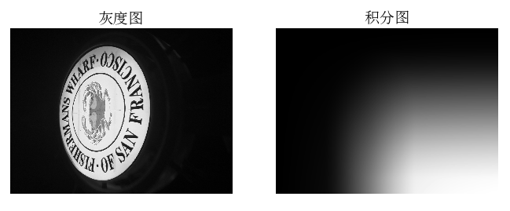
第二个例子从种子像素开始应用泛洪(漫水)填充：

```python
# -*- coding: utf-8 -*-
import cv2
import numpy
from pylab import *


# 添加中文字体支持
from matplotlib.font_manager import FontProperties
font = FontProperties(fname=r"c:\windows\fonts\SimSun.ttc", size=14)

# 读入图像
filename = '../data/fisherman.jpg'
im = cv2.imread(filename)
# 转换颜色空间
rgbIm = cv2.cvtColor(im, cv2.COLOR_BGR2RGB)

# 显示原图
fig = plt.figure()
subplot(121)
plt.gray()
imshow(rgbIm)
title(u'原图', fontproperties=font)
axis('off')

# 获取图像尺寸
h, w = im.shape[:2]
# 泛洪填充
diff = (6, 6, 6)
mask = zeros((h+2, w+2), numpy.uint8)
cv2.floodFill(im, mask, (10, 10), (255, 255, 0), diff, diff)

# 显示泛洪填充后的结果
subplot(122)
imshow(im)
title(u'泛洪填充', fontproperties=font)
axis('off')

show()
#fig.savefig("../images/ch10/floodFill.png")

# 在OpenCV窗口中显示泛洪填充后的结果
# cv2.imshow('flood fill', im)
# cv2.waitKey()
# 保存结果
# cv2.imwrite('../images/ch10/floodFill.jpg',im)
```
译者使用的是matplotlib显示泛洪填充后的结果，上面代码底下的注释部分是用OpenCV显示泛洪填充的结果。如果你用OpenCV窗口显示上面运行的结果，可以反注释。下面是上面泛洪填充后的结果：
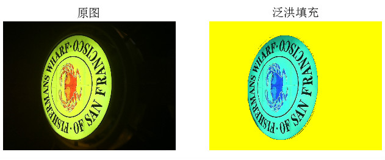
作为最后一个例子，我们看一下提取图像的SURF[(加速稳健特征)](http://zh.wikipedia.org/wiki/%E5%8A%A0%E9%80%9F%E7%A8%B3%E5%81%A5%E7%89%B9%E5%BE%81)特征。SURF是SIFT特征的一个快速版本。这里我们也会展示一些OpenCV绘制命令。

```python
# -*- coding: utf-8 -*-
import cv2
import numpy
from pylab import *


# 读入图像
im = cv2.imread('../data/empire.jpg')
# 下采样
im_lowres = cv2.pyrDown(im)
# 转化为灰度图像
gray = cv2.cvtColor(im_lowres, cv2.COLOR_RGB2GRAY)
# 检测特征点
s = cv2.SURF()
mask = numpy.uint8(ones(gray.shape))
keypoints = s.detect(gray, mask)
# 显示图像及特征点
vis = cv2.cvtColor(gray, cv2.COLOR_GRAY2BGR)
for k in keypoints[::10]:
    cv2.circle(vis, (int(k.pt[0]), int(k.pt[1])), 2, (0, 255, 0), -1)
    cv2.circle(vis, (int(k.pt[0]), int(k.pt[1])), int(k.size), (0, 255, 0), 2)
cv2.imshow('local descriptors', vis)
cv2.waitKey()

cv2.imwrite('../images/ch10/ch10_P261_Fig10-3.jpg',vis)
```
上面代码先读入一幅图像，用`pyrDown`下采样，得到的一幅尺寸是原图像尺寸一半的降采样图像，即im_lowres，然后将图像转换为灰度图像，并将它传递给SURF关键点检测对象。运行上面代码，可得下面SURF特征点检测结果：


<h2 id="sec-10-3">10.3 视频处理</h2>

单纯利用Python处理视频是比较困难的，因为要考虑到速度、编解码器、摄像机、操作系统已经文件格式等问题。目前Python还没有视频处理库。Python处理视频的接口仅有的较好的就是OpenCV。在这一节，我们会展示一些对视频进行处理的基本例子。

<h3 id="sec-10-3-1">10.3.1 视频输入</h3>

OpenCV能够很好地支持视频的读入。下面的例子展示了捕获视频帧，并在OpenCV窗口中显示它们：

```python
import cv2
# setup video capture
cap = cv2.VideoCapture(0)
while True:
    ret,im = cap.read()
    cv2.imshow('video test',im)
    key = cv2.waitKey(10)
    if key == 27:
        break
    if key == ord(' '):
    cv2.imwrite('vid_result.jpg',im)
```
上面VideoCapture从摄像头或文件中捕获视频。这里我们给它传递了一个整数作为初始化参数，它实际是视频设备的ID号，对于单个连着的摄像头，其ID号为0。read()方法解码并返回下一视频帧。waitKey()函数等待用户按下“Esc”(对应的ASCII码为27)终止应用，或按“space”将当前帧保存起来。

我们将上面例子进行拓展，使其能够在OpenCV窗口中对输出的视频进行模糊。对上面的例子进行稍微的修改便可实现该功能：

```python
import cv2
# setup video capture
cap = cv2.VideoCapture(0)
# get frame, apply Gaussian smoothing, show result
while True:
    ret,im = cap.read()
    blur = cv2.GaussianBlur(im,(0,0),10)
    cv2.imshow('camera blur',blur)
    if cv2.waitKey(10) == 27:
        break
```
上面对每一帧图像，将其传给GaussianBlur()函数，该函数实现对图像进行高斯滤波。在这个实例中，我们传递的是彩色图像，每一个颜色通道可以分别对其进行模糊。该函数以一个滤波器大小元组及高斯函数的标准差作为输入，如果滤波器大小设置为0，则它自动赋为标准差。运行上面的结果如下：


<h3 id="sec-10-3-2">10.3.2 读取视频到NumPy数组</h3>

OpenCV可以从一个文件中读取视频帧序列，并将它们转换成NumPy数组。下面给出了一个从摄像头捕获视频，并将它们存储在NumPy数组中的例子。

```python
import cv2
from pylab import *
# setup video capture
cap = cv2.VideoCapture(0)
frames = []
# get frame, store in array
while True:
    ret,im = cap.read()
	cv2.imshow('video',im)
	frames.append(im)
	if cv2.waitKey(10) == 27:
		break
frames = array(frames)
# check the sizes
print im.shape
print frames.shape
```
上面每一帧数组会被添加到列表的末尾直到捕获终止。打印出的数组大小表示的帧数、高度、宽度、3。运行上面代码打印出的结果为：

```text
(480, 640, 3)
(40, 480, 640, 3)
```
这里，记录了40帧。类似如这样的视频数据数组非常适合视频处理，比兔计算视频帧差异以及跟踪。

<h2 id="sec-10-4">10.4 跟踪</h2>

跟踪是对视频帧序列中的物体进行跟踪。

<h3 id="sec-10-4-1">10.4.1 光流法</h3>

<h3 id="sec-10-4-2">10.4.2 Lucas-Kanade算法</h3>

Lucas-Kanade算法原理这里略，具体可以参阅中译本。

```python
import lktrack

imnames = ['../data/bt/bt.003.pgm', '../data/bt/bt.002.pgm', '../data/bt/bt.001.pgm', '../data/bt/bt.000.pgm']
# create tracker object
lkt = lktrack.LKTracker(imnames)
# detect in first frame, track in the remaining
lkt.detect_points()
lkt.draw()
for i in range(len(imnames)-1):
    lkt.track_points()
    lkt.draw()
```


```python
import lktrack
from pylab import *
imnames = ['../data/viff/viff.000.ppm', '../data/viff/viff.001.ppm',
           '../data/viff/viff.002.ppm', '../data/viff/viff.003.ppm', '../data/viff/viff.004.ppm']
# track using the LKTracker generator
lkt = lktrack.LKTracker(imnames)
for im,ft in lkt.track():
    print 'tracking %d features' % len(ft)

# plot the tracks
figure()
imshow(im)
for p in ft:
    plot(p[0],p[1],'bo')
for t in lkt.tracks:
    plot([p[0] for p in t],[p[1] for p in t])
axis('off')
show()
```
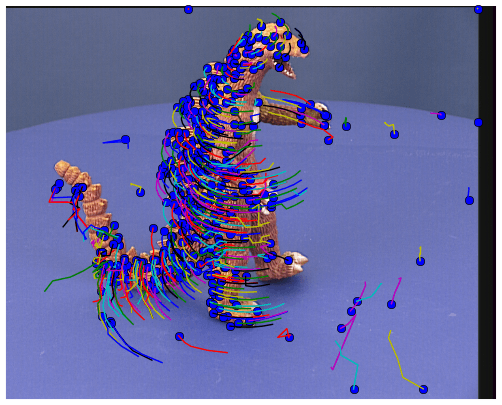

我们在[第九章](chapter9.html)中已经实现了一个完整且符合 REST 架构的资源：用户，本章我们要再实现一个资源：用户微博（micropost）。<sup>[1](#fn-1)</sup>微博是由用户发布的一种简短消息，我们在[第二章](chapter2.html)中实现了微博的雏形。 本章我们会在 [2.3 节](chapter2.html#sec-2-3)的基础上，实现一个功能完善的 Microposts 资源。首先，我们要创建微博所需的数据模型，通过  `has_many` 和 `belongs_to` 方法把微博和用户关联起来，再建立处理和显示微博所需的表单及局部视图。在 [第十一章](chapter11.html)，还要加入关注其他用户的功能，其时，我们这个山寨版 Twitter 才算完成。

如果你使用 Git 做版本控制的话，和之前一样，我建议你新建一个分支：

```sh
$ git checkout -b user-microposts
```

<h2 id="sec-10-1">10.1 Microposts 模型</h2>

实现 Microposts 资源的第一步是创建微博所需的数据模型，在模型中设定微博的基本属性。和 [2.3 节](chapter2.html#sec-2-3) 创建的模型类似，我们要实现的 Micropost 模型要包含数据验证，以及和 User 模型的关联。除此之外，我们还会做充分的测试，指定默认的排序方式，自动删除已注销用户的微博。

<h3 id="sec-10-1-1">10.1.1 基本模型</h3>

Micropost 模型只需要两个属性：一个是 `content`，用来保存微博的内容；<sup>[2](#fn-2)</sup>另一个是 `user_id`，把微博和用户关联起来。我们要使用 `generate model` 命令生成所需的模型，这一点和创建用户模型时是一样的（参见代码 6.1）：

```sh
$ rails generate model Micropost content:string user_id:integer
```

这个命令会生成一个迁移文件，在数据库中生成一个名为 `microposts` 的表（参见代码 10.1）。读者朋友可以和生成 `users` 表的迁移文件对照一下（参见代码 6.2）。

**代码 10.1** 创建微博模型的迁移文件（注意：为 `user_id` 和 `created_at` 列加入了索引）<br />`db/migrate/[timestamp]_create_microposts.rb`

```ruby
class CreateMicroposts < ActiveRecord::Migration
  def change
    create_table :microposts do |t|
      t.string :content
      t.integer :user_id

      t.timestamps
    end
    add_index :microposts, [:user_id, :created_at]
  end
end
```

注意，因为我们设想要按照发布时间的倒序查询某个用户所有的微博，所以在上述代码中为 `user_id` 和 `created_at` 列加入了索引：

```ruby
add_index :microposts, [:user_id, :created_at]
```

我们把 `user_id` 和 `created_at` 放在一个数组中，告诉 Rails 我们要创建的是“多键索引（multiple key index）”，Active Record 便会同时使用这两个键。还要注意 `t.timestamps` 这行，我们在 [6.1.1 节](chapter6.html#sec-6-1-1)中介绍过，它会自动创建 `created_at` 和 `updated_at` 两个属性。在 [10.1.4 节](chapter10.html#sec-10-1-4) 和 [10.2.1 节](chapter10.html#sec-10-2-1) 中才会用到 `created_at`。

我们先参照 User 模型的测试（参照代码 6.8），为 Micropost 模型编写一些基本的测试。我们要测试微博对象是否可以响应 `content` 和 `user_id` 方法，如代码 10.2 所示。

**代码 10.2** Micropost 模型测试（初始版）<br />`spec/models/micropost_spec.rb`

```ruby
require 'spec_helper'

describe Micropost do

  let(:user) { FactoryGirl.create(:user) }
  before do
    # This code is wrong!
    @micropost = Micropost.new(content: "Lorem ipsum", user_id: user.id)
  end

  subject { @micropost }

  it { should respond_to(:content) }
  it { should respond_to(:user_id) }
end
```

若要这个测试通过，我们先要执行数据库迁移，再准备好“测试数据库”：

```sh
$ bundle exec rake db:migrate
$ bundle exec rake db:test:prepare
```

执行上面两个命令之后，会生成 Micropost 模型，结构如图 10.1 所示。


图 10.1：Micropost 数据模型

然后确认测试是否可以通过：

```sh
$ bundle exec rspec spec/models/micropost_spec.rb
```

测试虽然可以通过，不过你可能注意到代码 10.2 中的这几行代码了：

```ruby
let(:user) { FactoryGirl.create(:user) }
before do
  # This code is wrong!
  @micropost = Micropost.new(content: "Lorem ipsum", user_id: user.id)
end
```

就像其中的注释所说，`before` 块中的代码是错误的。你可以想一下为什么，我们会在下一小节中告诉你答案。

<h3 id="sec-10-1-2">10.1.2 可访问的属性和第一个数据验证</h3>

要知道为什么 `before` 块中的代码是错误的，我们先要为 Micropost 模型编写一个数据验证测试，如代码 10.3 所示。（读者朋友可以和代码 6.11 中针对 User 模型的测试对比一下。）

**代码 10.3** 测试微博能否通过验证<br />`spec/models/micropost_spec.rb`

```ruby
require 'spec_helper'

describe Micropost do

  let(:user) { FactoryGirl.create(:user) }
  before do
    # This code is wrong!
    @micropost = Micropost.new(content: "Lorem ipsum", user_id: user.id)
  end

  subject { @micropost }

  it { should respond_to(:content) }
  it { should respond_to(:user_id) }

  it { should be_valid }

  describe "when user_id is not present" do
    before { @micropost.user_id = nil }
    it { should_not be_valid }
  end
end
```

这段代码测试了微博是否能够通过验证，以及是否指定了 `user_id` 的值。要想让上述测试通过，我们要按照代码 10.4 所示，加入一个简单的存在性验证。

**代码 10.4** 对微博 `user_id` 属性的验证<br />`app/models/micropost.rb`

```ruby
class Micropost < ActiveRecord::Base
  attr_accessible :content, :user_id
  validates :user_id, presence: true
end
```

现在我就来告诉你为什么 `@micropost = Micropost.new(content: "Lorem ipsum", user_id: user.id)` 是错的。

在 Rails 3.2.3 之前，默认情况下 Micropost 模型的所有属性都是可访问的，我们在 [6.1.2.2 节](chapter6.html#sec-6-1-2-2)和 [9.4.1 节](chapter9.html#sec-9-4-1) 中做过介绍，可访问就意味着任何人都可以篡改微博对象的属性值，然后通过命令行发送非法请求。例如，某非法用户可以篡改微博的 `user_id` 属性，把该微博的作者设定为错误的用户。所以，我们要把 `user_id` 从 `attr_accessible` 定义的可访问属性列表中删除。如果你真的删除了，上面的测试也就会失败了。我们会在 [10.1.3 节](#sec-10-1-3)中再次让这个测试通过。

<h3 id="sec-10-1-3">10.1.3 用户和微博之间的关联</h3>

在为 Web 程序构建数据模型时，最基本的考虑要素是要能够在不同的模型之间建立关联。在我们这个程序中，每篇微博都关联着一个用户，而每个用户一般都会关联多篇微博。用户和微博之间的关系在 [2.3.3 节](chapter2.html#sec-2-3-3)中简单的介绍过，二者之间的关系如图 10.2 和图 10.3 所示。在实现这种关联的时候，我们会编写针对 Micropost 模型的测试，和代码 10.2 不同的是，测试的代码会顾及代码 10.7 中使用的 `attr_accessible`。


图 10.2：微博和用户之间的“属于（`belongs_to`）”关系

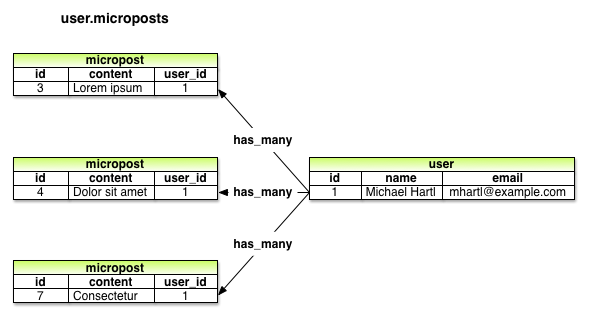

图 10.3：用户和微博之间的“拥有多个（`has_many`）”关系

使用本小节介绍的 `belongs_to` 和 `has_many` 之后，Rails 会自动创建如[表格 10.1](#table-10-1) 所示的方法。

<table id="table-10-1" class="tabular">
  <tbody>
    <tr>
      <th class="align_left"><strong>方法</strong></th>
      <th class="align_left"><strong>作用</strong></th>
    </tr>
    <tr class="top_bar">
      <td class="align_left"><code>micropost.user</code></td>
      <td class="align_left">返回该微博对应的用户对象</td>
    </tr>
    <tr>
      <td class="align_left"><code>user.microposts</code></td>
      <td class="align_left">返回该用户的所有微博数组</td>
    </tr>
    <tr>
      <td class="align_left"><code>user.microposts.create(arg)</code></td>
      <td class="align_left">创建一篇微博（<code>user_id = user.id</code>）</td>
    </tr>
    <tr>
      <td class="align_left"><code>user.microposts.create!(arg)</code></td>
      <td class="align_left">创建一篇微博（失败时抛出异常）</td>
    </tr>
    <tr>
      <td class="align_left"><code>user.microposts.build(arg)</code></td>
      <td class="align_left">生成一个新的微博对象（<code>user_id = user.id</code>）</td>
    </tr>
  </tbody>
</table>

表格 10.1：用户和微博关联后所得方法的简介

注意，从表格 10.1 可知，相较于以下的方法

```ruby
Micropost.create
Micropost.create!
Micropost.new
```

我们得到了

```ruby
user.microposts.create
user.microposts.create!
user.microposts.build
```

后者才是创建微博的正确方式，即通过相关联的用户对象创建。通过这种方式创建的微博，其 `user_id` 属性会自动设为正确的值，从而解决了 [10.1.2 节](#sec-10-1-2)中提出的问题。所以，我们可以把代码 10.3 中的下述代码

```ruby
let(:user) { FactoryGirl.create(:user) }
before do
  # This code is wrong!
  @micropost = Micropost.new(content: "Lorem ipsum", user_id: user.id)
end
```

修改为

```ruby
let(:user) { FactoryGirl.create(:user) }
before { @micropost = user.microposts.build(content: "Lorem ipsum") }
```

只要正确定义了用户和微博之间的关联关系，`@micropost` 变量的 `user_id` 属性就会自动设为相对应用户的 id。

通过用户对象来创建微博并没有消除 `user_id` 是可访问属性这一安全隐患，而这一隐患又是如此危险，所以我们要添加一个测试来捕获它，如代码 10.5 所示。

**代码 10.5** 确保 `user_id` 不可访问的测试<br />`spec/models/micropost_spec.rb`

```ruby
require 'spec_helper'

describe Micropost do

  let(:user) { FactoryGirl.create(:user) }
  before { @micropost = user.microposts.build(content: "Lorem ipsum") }

  subject { @micropost }
  .
  .
  .
  describe "accessible attributes" do
    it "should not allow access to user_id" do
      expect do
        Micropost.new(user_id: user.id)
      end.to raise_error(ActiveModel::MassAssignmentSecurity::Error)
    end
  end
end
```

如果调用 `Micropost.new` 方法时指定了非空的 `user_id`，这段测试会检测程序是否抛出了 `MassAssignmentSecurity` 异常。这种处理方式在 Rails 3.2.3 中默认是开启的，但是在之前的版本中却是关闭的，所以你要查看一下你的程序设置是否正确，如代码 10.6 所示。

**代码 10.6** 确保没有正确指定 mass assignment 的属性时 Rails 会抛出异常<br />`config/application.rb`

```ruby
.
.
.
module SampleApp
  class Application < Rails::Application
    .
    .
    .
    config.active_record.whitelist_attributes = true
    .
    .
    .
  end
end
```

对 Micropost 模型而言，只有一个属性是需要通过网页修改的，那就是 `content`，所以我们要把 `user_id` 从可访问的属性列表中删掉，如代码 10.7 所示。

**代码 10.7** 有且只有 `content` 属性是可访问的<br />`app/models/micropost.rb`

```ruby
class Micropost < ActiveRecord::Base
  attr_accessible :content

  validates :user_id, presence: true
end
```

如[表格 10.1](#table-10-1) 所示，用户和微博建立关联之后，还会生成 `micropost.user` 方法，返回该微博的用户对象。对此，我们可以使用 `it` 和 `its` 做个测试：

```ruby
it { should respond_to(:user) }
its(:user) { should == user }
```

以上对 Micropost 模型的测试结合在一起后如代码 10.8 所示。

**代码 10.8** 测试微博和用户之间的关联<br />`spec/models/micropost_spec.rb`

```ruby
require 'spec_helper'

describe Micropost do

  let(:user) { FactoryGirl.create(:user) }
  before { @micropost = user.microposts.build(content: "Lorem ipsum") }

  subject { @micropost }

  it { should respond_to(:content) }
  it { should respond_to(:user_id) }
  it { should respond_to(:user) }
  its(:user) { should == user }

  it { should be_valid }

  describe "accessible attributes" do
    it "should not allow access to user_id" do
      expect do
        Micropost.new(user_id: user.id)
      end.to raise_error(ActiveModel::MassAssignmentSecurity::Error)
    end
  end

  describe "when user_id is not present" do
    before { @micropost.user_id = nil }
    it { should_not be_valid }
  end
end
```

在用户和微博关联关系的 User 模型一边，我们会在 [10.1.4 节](#sec-10-1-4)做详细的测试，现在我们只是简单的测试下是否可以响应 `microposts` 方法，如代码 10.9 所示。

**代码 10.9** 测试用户对象是否可以响应 `microposts` 方法<br />`spec/models/user_spec.rb`

```ruby
require 'spec_helper'

describe User do

  before do
    @user = User.new(name: "Example User", email: "user@example.com",
                     password: "foobar", password_confirmation: "foobar")
  end

  subject { @user }
  .
  .
  .
  it { should respond_to(:authenticate) }
  it { should respond_to(:microposts) }
  .
  .
  .
end
```

写好了上面的测试，实现用户和微博之间关联就简单了：只需分别加入下面这两行代码，代码 10.8 和代码 10.9 中的测试就可以通过了：`belongs_to :user`（如代码 10.10 所示）和 `has_many :microposts`（如代码 10.11 所示）。

**代码 10.10** 微博“属于（`belongs_to`）”用户<br />`app/models/micropost.rb`

```ruby
class Micropost < ActiveRecord::Base
  attr_accessible :content
  belongs_to :user

  validates :user_id, presence: true
end
```

**代码 10.11** 用户“拥有多篇（`has_many`）”微博<br />`app/models/user.rb`

```ruby
class User < ActiveRecord::Base
  attr_accessible :name, :email, :password, :password_confirmation
  has_secure_password
  has_many :microposts
  .
  .
  .
end
```

现在，你应该结合[表格 10.1](#table-10-1)和代码 10.8、代码 10.9，确保你理解了关联的基本知识点。你还应该检查一下测试是否可以通过：

```sh
$ bundle exec rspec spec/models
```

<h3 id="sec-10-1-4">10.1.4 改进 Micropost 模型</h3>

代码 10.9 中的代码并没有深入测试通过 `has_many` 实现的关联，仅仅检测了是否可以响应 `microposts` 方法。本小节，我们会为 Micropost 模型加入排序方法和依属关系，还会测试 `user.microposts` 方法的返回结果是否为数组。

我们需要在 User 模型的测试中生成一些微博，所以现在我们先要创建一个生成微博的预构件。在所创建的预构件中我们要找到一种方法把微博和用户关联起来，幸运的是，在 FactoryGirl 中实现关联是很容易的，如代码 10.12 所示。

**代码 10.12** 完整的预构件文件，包含了创建微博的新预构件<br />`spec/factories.rb`

```ruby
FactoryGirl.define do
  factory :user do
    sequence(:name)  { |n| "Person #{n}" }
    sequence(:email) { |n| "person_#{n}@example.com"}
    password "foobar"
    password_confirmation "foobar"

    factory :admin do
      admin true
    end
  end

  factory :micropost do
    content "Lorem ipsum"
    user
  end
end
```

在 FactoryGirl 中我们只需要在创建微博的预构件中包含一个用户对象就可以实现所需的关联了：

```ruby
factory :micropost do
  content "Lorem ipsum"
  user
end
```

在下一节中会介绍，我们可以使用下面的方法生成一篇微博：

```ruby
FactoryGirl.create(:micropost, user: @user, created_at: 1.day.ago)
```

#### 默认作用域

默认情况下，使用 `user.microposts` 从数据库中读取用户的微博不能保证微博的次序，但是按照博客和 Twitter 的习惯，我们希望微博按照创建时间倒序排列，也就是最新创建的微博在最前面。要测试微博的次序，我们要先创建两篇微博：

```ruby
FactoryGirl.create(:micropost, user: @user, created_at: 1.day.ago)
FactoryGirl.create(:micropost, user: @user, created_at: 1.hour.ago)
```

我们把第二篇微博的创建时间设的晚一些，即 `1.hour.ago`（利用了[旁注 8.1](chapter8.html#box-8-1)中介绍的帮助函数），第一篇微博的创建时间要早一些，是 `1.day.ago`。请注意一下使用 FactoryGirl 创建微博是多么方便：我们不仅可以直接指定微博所属的用户（FactoryGirl 会逃过 `attr_accessible` 限制），还可以设定通常情况下不能自由设定的 `created_at` 属性（因为在 Active Record 做了限制）。（再次说明一下，`created_at` 和 `updated_at` 两个属性是“魔法”列，会被自动设为相应的创建时间戳和更新时间戳，即使手动指定了值也会被覆盖。）

大多数数据库适配器（包括 SQLite 的适配器）读取的微博都是按照 ID 来排序的，因此代码 10.13 中的测试肯定不会通过。在这段测试代码中没有使用 `let`，而用了 `let!`（读作“let bang”），因为 `let` 方法指定的变量是“惰性”的，只有当后续有引用时才会被创建。而我们希望这两个微博变量立即被创建，这样才能保证两篇微博时间戳的顺序是正确的，也保证了 `@user.microposts` 数组不是空的。所以我们才用了 `let!` 方法，强制相应的变量立即被创建。

**代码 10.13** 测试用户微博的次序<br />`spec/models/user_spec.rb`

```ruby
require 'spec_helper'

describe User do
  .
  .
  .
  describe "micropost associations" do

    before { @user.save }
    let!(:older_micropost) do
      FactoryGirl.create(:micropost, user: @user, created_at: 1.day.ago)
    end
    let!(:newer_micropost) do
      FactoryGirl.create(:micropost, user: @user, created_at: 1.hour.ago)
    end

    it "should have the right microposts in the right order" do
      @user.microposts.should == [newer_micropost, older_micropost]
    end
  end
end
```

这个测试中最关键的一行是：

```ruby
@user.microposts.should == [newer_micropost, older_micropost]
```

这行代码表明所创建的微博应该按照创建时间倒序排列，即最新创建的微博排在最前面。这个测试注定是无法通过的，因为微博默认是按照 ID 排序的，即 `[older_micropost, newer_micropost]`。这个测试同时也验证了 `has_many` 关联最基本的效果是否正确，即检测 `user.microposts` 返回的结果是否是数组。

要让这个测试通过，我们要使用 Rails 中的 `default_scope` 方法，还要设定它的 `:order` 参数，如代码 10.14 所示。（这是我们第一次接触作用域的概念，在[第十一章](chapter11.html)中会介绍作用域更一般的用法。）

**代码 10.14** 通过 `default_scope` 设定微博的排序<br />`app/models/micropost.rb`

```ruby
class Micropost < ActiveRecord::Base
  .
  .
  .
  default_scope order: 'microposts.created_at DESC'
end
```

我们通过 `microposts.created_at DESC` 设定了所需的排序，其中 `DESC` 在 SQL 中是“倒序”的意思，即按照由新到旧这种顺序排序。

#### 依属关系：destroy

除了设定恰当的排序外，我们还要对微博模型做另一项改进。我们在 [9.4 节](chapter9.html#sec-9-4)中介绍过，管理员是有权限删除用户的。那么，在删除用户的同时，就有必要把该用户发布的微博也删除。对此我们可以编写一个测试，检测当用户被删除后，其发布的微博是否还在数据库中。

为了能够正确的测试微博是否被删除了，我们先要把用户的一篇微博赋值给一个局部变量，然后再删除这个用户。对此，一种比较直观的实现方式如下所示：

```ruby
microposts = @user.microposts
@user.destroy
microposts.each do |micropost|
  # Make sure the micropost doesn't appear in the database.
end
```

可是上述方式并不凑效，这涉及到 Ruby 中数组的一个诡异表现。在 Ruby 中把数组赋值给变量时，只是获取了该数组的引用，而不是数组的值本身，所以如果修改了原始的数组，它的引用也会改变。举个例子，我们新建一个数组，再把它赋值给另一个变量，然后调用 `reverse!` 反转第一个数组：

```sh
$ rails console
>> a = [1, 2, 3]
=> [1, 2, 3]
>> b = a
=> [1, 2, 3]
>> a.reverse!
=> [3, 2, 1]
>> a
=> [3, 2, 1]
>> b
=> [3, 2, 1]
```

可能有点奇怪，`b` 的值和 `a` 一样也反转了，因为 `a` 和 `b` 指向的是同一个数组。（类似的表现也可以推广到 Ruby 中其他的数据类型，例如字符串和 Hash。）

再来看用户的微博，结果如下：

```sh
$ rails console --sandbox
>> @user = User.first
>> microposts = @user.microposts
>> @user.destroy
>> microposts
=> []
```

（因为我们还没有实现销毁所关联微博的方法，所以上述的操作是无效的，在这里列出来只是要演示这种表现。）我们可以看到，删除用户后，`microposts` 变量的值也为空了，即空的数组 `[]`。

鉴于此，在复制 Ruby 对象时要格外的小心。在赋值一些相对简单的对象时，例如数组，我们可以调用 `dup` 方法：

```sh
$ rails console
>> a = [1, 2, 3]
=> [1, 2, 3]
>> b = a.dup
=> [1, 2, 3]
>> a.reverse!
=> [3, 2, 1]
>> a
=> [3, 2, 1]
>> b
=> [1, 2, 3]
```

（上面展示的是“浅拷贝（shallow copy）”。“深拷贝（deep copy）”是很复杂的，也没用通用的方法，如果你要赋值复杂的数据结构，例如嵌套的数组，可以搜索一下“ruby deep copy”，应该可以找到一些方法。）使用 `dup` 方法后的代码如下：

```ruby
microposts = @user.microposts.dup
@user.destroy
microposts.should_not be_empty
microposts.each do |micropost|
  # Make sure the micropost doesn't appear in the database.
end
```

我们还加入了下面这行：

```ruby
microposts.should_not be_empty
```

这才能确保测试可以扑捉到因为失手删除 `dup` 导致的错误。<sup>[3](#fn-3)</sup> 完整的测试代码如代码 10.15 所示。

**代码 10.15** 测试用户删除后，所发布的微博是否也被删除了<br />`spec/models/user_spec.rb`

```ruby
require 'spec_helper'

describe User do
  .
  .
  .
  describe "micropost associations" do

    before { @user.save }
    let!(:older_micropost) do
      FactoryGirl.create(:micropost, user: @user, created_at: 1.day.ago)
    end
    let!(:newer_micropost) do
      FactoryGirl.create(:micropost, user: @user, created_at: 1.hour.ago)
    end
    .
    .
    .
    it "should destroy associated microposts" do
      microposts = @user.microposts.dup
      @user.destroy
      microposts.should_not be_empty
      microposts.each do |micropost|
        Micropost.find_by_id(micropost.id).should be_nil
      end
    end
  end
  .
  .
  .
end
```

在这个测试中，我们调用的是 `Micropost.find_by_id` 方法，如果没有找到相应的记录这个方法会返回 `nil`。而 `Micropost.find` 方法在没有找到记录时直接抛出异常，比较难测试。（如果你好奇如何测试 `Micropost.find` 抛出的异常，可以使用下面这段代码。）

```ruby
lambda do
  Micropost.find(micropost.id)
end.should raise_error(ActiveRecord::RecordNotFound)
```

要让代码 10.15 中的测试通过，我们甚至不需要加入一行完整的代码，只需在 `has_many` 方法中设定一个参数即可，如代码 10.16 所示。

**代码 10.16** 保证用户的微博在删除用户的同时也会被删除<br />`app/models/user.rb`

```ruby
class User < ActiveRecord::Base
  attr_accessible :name, :email, :password, :password_confirmation
  has_secure_password
  has_many :microposts, dependent: :destroy
  .
  .
  .
end
```

上面代码中有这么一行：

```ruby
has_many :microposts, dependent: :destroy
```

其中的 `dependent: :destroy` 设定程序在用户被删除的时候，其所属的微博也要被删除。这么一来，如果管理员删除了用户，数据库中就不会出现无主的微博了。

至此，用户和微博之间的关联就设置好了，所有的测试应该都可以通过了：

```sh
$ bundle exec rspec spec/
```

<h3 id="sec-10-1-5">10.1.5 验证微博内容</h3>

在结束讨论 Micropost 模型之前，我们还要为微博的内容加上数据验证（参照 [2.3.2 节](chapter2.html#sec-2-3-2)）。和 `user_id` 一样，`content` 属性不能为空，而且还要限制内容的长度不能多于 140 个字符，这才是真正的“微”博。我们要编写的测试和 [6.2 节](chapter6.html#sec-6-2)中对用户模型的验证测试类似，如代码 10.17 所示。

**代码 10.17** 测试 Micropost 模型的数据验证<br />`spec/models/micropost_spec.rb`

```ruby
require 'spec_helper'

describe Micropost do

  let(:user) { FactoryGirl.create(:user) }
  before { @micropost = user.microposts.build(content: "Lorem ipsum") }
  .
  .
  .
  describe "when user_id is not present" do
    before { @micropost.user_id = nil }
    it { should_not be_valid }
  end

  describe "with blank content" do
    before { @micropost.content = " " }
    it { should_not be_valid }
  end

  describe "with content that is too long" do
    before { @micropost.content = "a" * 141 }
    it { should_not be_valid }
  end
end
```

和 [6.2 节](chapter6.html#sec-6-2)一样，在代码 10.17 中我们用到了字符串乘积来测试微博内容长度的验证：

```sh
$ rails console
>> "a" * 10
=> "aaaaaaaaaa"
>> "a" * 141
=> "aaaaaaaaaaaaaaaaaaaaaaaaaaaaaaaaaaaaaaaaaaaaaaaaaaaaaaaaaaaaaaaaaaaaaaa
aaaaaaaaaaaaaaaaaaaaaaaaaaaaaaaaaaaaaaaaaaaaaaaaaaaaaaaaaaaaaaaaaaaaaa"
```

我们需要在程序中加入下面这行代码：

```ruby
validates :content, presence: true, length: { maximum: 140 }
```

Micropost 模型的最终代码如代码 10.18 所示。

**代码 10.18** Micropost 模型的数据验证<br />`app/models/micropost.rb`

```ruby
class Micropost < ActiveRecord::Base
  attr_accessible :content

  belongs_to :user

  validates :content, presence: true, length: { maximum: 140 }
  validates :user_id, presence: true

  default_scope order: 'microposts.created_at DESC'
end
```

<h2 id="sec-10-2">10.2 显示微博</h2>

尽管我们还没实现直接在网页中发布微博的功能（将在 [10.3.2 节](#sec-10-3-2)实现），不过我们还是有办法显示微博，并对显示的内容进行测试。我们将按照 Twitter 的方式，用户的微博不在 `index` 页面中显示，而在 `show` 页面中，构思图如图 10.4 所示。我们会先创建一些很简单的 ERb 代码，在用户的资料页面显示微博，然后要在 [9.3.2 节](chapter9.html#sec-9-3-2)中实现的数据生成器中加入生成微博的代码，这样我们才有内容可以显示。

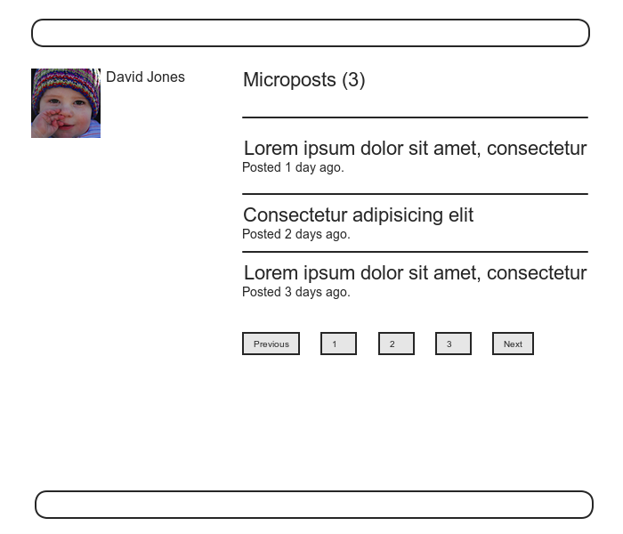

图 10.4：显示了微博的资料页面构思图

和 [8.2.1 节](chapter8.html#sec-8-2-1)中对登录机制的介绍类似，[10.2.1 节](#sec-10-2-1)也会经常将一些元素推送到[堆栈](http://en.wikipedia.org/wiki/Stack\_\(data_structure\))里，然后再一个一个的从栈尾取出来。如果理解起来有点困难，多点耐心，你的付出会在 [10.2.2 节](#sec-10-2-2)得到回报。

<h3 id="sec-10-2-1">10.2.1 充实用户资料页面</h3>

我们先在用户的 request spec 中加入对显示微博的测试。我们采用的方法是，先通过预构件创建几篇微博，然后检查用户资料页面是否显示了这几篇微博，同时我们还要验证是否显示了如图 10.4 中所示的总的微博数量。

我们可以使用 `let` 方法创建微博，不过如代码 10.13 所示，我们希望用户和微博的关联立即生效，这样微博才能显示在用户的资料页面中。所以，我们要使用 `let!` 方法：

```ruby
let(:user) { FactoryGirl.create(:user) }
let!(:m1) { FactoryGirl.create(:micropost, user: user, content: "Foo") }
let!(:m2) { FactoryGirl.create(:micropost, user: user, content: "Bar") }

before { visit user_path(user) }
```

按照上面这种方式定义了微博后，我们就可以使用代码 10.19 中的代码测试用户资料页面中是否显示了这些微博。

**代码 10.19** 检测用户资料页面是否显示了微博的测试<br />`spec/requests/user_pages_spec.rb`

```ruby
require 'spec_helper'

describe "User pages" do
  .
  .
  .
  describe "profile page" do
    let(:user) { FactoryGirl.create(:user) }
    let!(:m1) { FactoryGirl.create(:micropost, user: user, content: "Foo") }
    let!(:m2) { FactoryGirl.create(:micropost, user: user, content: "Bar") }

    before { visit user_path(user) }

    it { should have_selector('h1',    text: user.name) }
    it { should have_selector('title', text: user.name) }

    describe "microposts" do
      it { should have_content(m1.content) }
      it { should have_content(m2.content) }
      it { should have_content(user.microposts.count) }
    end
  end
  .
  .
  .
end
```

注意，我们可以在关联关系的方法上调用 `count` 方法：

```ruby
user.microposts.count
```

这个 `count` 方法是很聪明的，可以直接在数据库层统计数量。也就是说，`count` 的计数过程不是把微博从数据库中取出来，然后再在所得的数组上调用 `length` 方法，如果这样做的话，微博数量一旦很多的话，效率就会很低。其实，`count` 方法会直接在数据库层中统计用户的微博数量。如果统计数量仍然是程序的性能瓶颈的话，你可以使用“[计数缓存](http://railscasts.com/episodes/23-counter-cache-column)”进一步提速。

在加入代码 10.21 之前，代码 10.19 中的测试是无法通过的，不过现在我们可以先在用户的资料页面中加入一些微博，如代码 10.20 所示。

**代码 10.20** 在用户资料页面中加入微博<br />`app/views/users/show.html.erb`

```erb
<% provide(:title, @user.name) %>
<div class="row">
  .
  .
  .
  <aside>
    .
    .
    .
  </aside>
  <div class="span8">
    <% if @user.microposts.any? %>
      <h3>Microposts (<%= @user.microposts.count %>)</h3>
      <ol class="microposts">
        <%= render @microposts %>
      </ol>
      <%= will_paginate @microposts %>
    <% end %>
  </div>
</div>
```

微博列表稍后分析，现在先看看其他部分。在这段代码中，`if @user.microposts.any?`（在代码 7.23 中见过类似的用法）的作用是，如果用户没有发布微博的话，就不会显示后面的列表。

还要注意一下，在代码 10.20 中我们也加入了微博的分页显示功能：

```erb
<%= will_paginate @microposts %>
```

如果和用户索引页面中对应的代码（参见代码 9.34）比较的话，会发现，之前所用的代码是：

```erb
<%= will_paginate %>
```

之前之所以可以直接调用，是因为在 Users 控制器中，`will_paginate` 默认程序中存在一个名为 `@users` 的变量（在 [9.3.3 节](chapter9.html#sec-9-3-3)中介绍过，该变量的值必须是 `AvtiveRecord::Relation` 的实例）。现在，虽然我们还在 Users 控制器中，但是我们要对**微博**分页，所以 `will_paginate` 方法要指定 `@microposts` 变量作为参数。当然了，我们还要在 `show` 动作中定义 `@microposts` 变量（参见代码 10.22）。

接着，还显示了当前微博的数量：

```erb
<h3>Microposts (<%= @user.microposts.count %>)</h3>
```

前面介绍过，`@user.microposts.count` 的作用和 `User.count` 类似，不过统计的微博数量却是建立在用户和微博的关联关系上的。

最后，我们来看一下显示微博的列表：

```erb
<ol class="microposts">
  <%= render @microposts %>
</ol>
```

这段代码使用了一个有序列表标签 `ol`，显示一个微博列表，不过关键的部分是通过一个微博局部视图实现的。在 [9.3.4 节](chapter9.html#sec-9-3-4)中介绍过，如下的代码

```erb
<%= render @users %>
```

会使用名为 `_user.html.erb` 的局部视图渲染 `@users` 变量中的每一个用户。因此，如下的代码

```erb
<%= render @microposts %>
```

会对微博做同样的渲染操作。所以，我们要创建名为 `_micropost.html.erb` 的局部视图（存放在微博对应的视图文件夹中），如代码 10.21 所示。

**代码 10.21** 显示单篇微博的局部视图<br />`app/views/microposts/_micropost.html.erb`

```erb
<li>
  <span class="content"><%= micropost.content %></span>
  <span class="timestamp">
    Posted <%= time_ago_in_words(micropost.created_at) %> ago.
  </span>
</li>
```

这段代码使用了 `time_ago_in_words` 帮助方法，会在 [10.2.2 节](#sec-10-2-2)中介绍。

至此，尽管定义了所需的全部视图，但是代码 10.19 中的测试仍旧无法通过，提示未定义 `@microposts` 变量。加入代码 10.22 中的代码后，测试就可以通过了。

**代码 10.22** 在 Users 控制器的 `show` 动作中加入 `@microposts` 实例变量<br />`app/controllers/users_controller.rb`

```ruby
class UsersController < ApplicationController
  .
  .
  .
  def show
    @user = User.find(params[:id])
    @microposts = @user.microposts.paginate(page: params[:page])
  end
end
```

请注意一下 `paginate` 方法是多么的智能，它甚至可以通过关联关系，在 `microposts` 数据表中取出每个分页中要显示的微博。

现在，我们可以查看一下刚编好的用户资料页面了，如图 10.5 所示，可能会出乎你的意料，这也是理所当然的，因为我们还没有发布微博呢。下面我们就来发布微博。

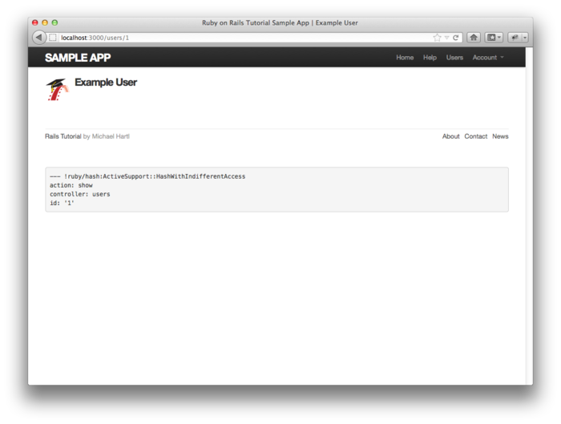

图 10.5：添加了显示微博代码后的用户资料页面，不过还没有微博可显示

<h3 id="sec-10-2-2">10.2.2 示例微博</h3>

在 [10.2.1 节](#sec-10-2-1)中为了显示微博，创建了几个视图，但是结果有点不给力。为了改变这个悲剧，我们要在 [9.3.2 节](chapter9.html#sec-9-3-2)中用到的示例数据生成器中加入生成微博数据的代码。如果给所有的用户都生成一些微博的话要用很长的时间，所以我们暂且只给前六个用户<sup>[4](#fn-4)</sup>生成微博数据，这要用到 `User.all` 方法的 `:limit` 选项：<sup>[5](#fn-5)</sup>

```ruby
users = User.all(limit: 6)
```

我们要为每个用户生成 50 篇微博（这个数量大于单页显示的 30 篇限制），使用 Faker gem 中简便的 `Lorem.sentence` 方法生成每篇微博的内容。（`Faker::Lorem.sentence` 生成的是 lorem ipsum 示例文字，我们在[第 6 章](chapter6.html)中介绍过，lorem ipsum 背后有一段[有趣的故事](http://www.straightdope.com/columns/read/2290/what-does-the-filler-text-lorem-ipsum-mean)。）代码 10.23 中显示的是修改后的示例数据生成器。

**代码 10.23** 在示例数据生成器中加入生成微博的代码<br />`lib/tasks/sample_data.rake`

```ruby
namespace :db do
  desc "Fill database with sample data"
  task populate: :environment do
    .
    .
    .
    users = User.all(limit: 6)
    50.times do
      content = Faker::Lorem.sentence(5)
      users.each { |user| user.microposts.create!(content: content) }
    end
  end
end
```

当然，如果要生成示例数据，我们要执行 `db:populate` 命令：

```sh
$ bundle exec rake db:reset
$ bundle exec rake db:populate
$ bundle exec rake db:test:prepare
```

然后，我们就能看到 [10.2.1 节](#sec-10-2-1)中劳动的果实了，在用户资料页面显示了生成的微博。<sup>[6](#fn-6)</sup>初步结果如图 10.6 所示。

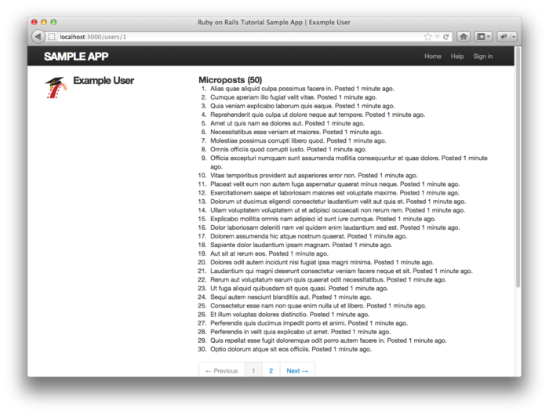

图 10.6：用户资料页面（[/users/1](http://localhost/users/1)）中显示的尚未样式化的微博列表

图 10.6 中显示的微博列表还没有加入样式，那我们就加入一些样式（参见代码 10.24）<sup>[7](#fn-7)</sup>，再看一下页面显示的效果。图 10.7 显示的是第一个用户（当前登录用户）的资料页面，图 10.8 显示的是另一个用户的资料页面，图 10.9 显示的是第一个用户资料页面的第 2 页，页面底部还显示了分页链接。注意观察这三幅图，我们可以看到微博后面显示了距离发布的时间（例如，“Posted 1 minute ago.”），这个效果是通过代码 10.21 中的 `time_ago_in_words` 方法实现的。过一会再刷新页面，你会发现这些文字依据当前时间自动更新了。

**代码 10.24** 微博列表的样式（包含了本章用到的所有样式）<br />`app/assets/stylesheets/custom.css.scss`

```scss
.
.
.

/* microposts */

.microposts {
  list-style: none;
  margin: 10px 0 0 0;

  li {
    padding: 10px 0;
    border-top: 1px solid #e8e8e8;
  }
}
.content {
  display: block;
}
.timestamp {
  color: $grayLight;
}
.gravatar {
  float: left;
  margin-right: 10px;
}
aside {
  textarea {
    height: 100px;
    margin-bottom: 5px;
  }
}
```

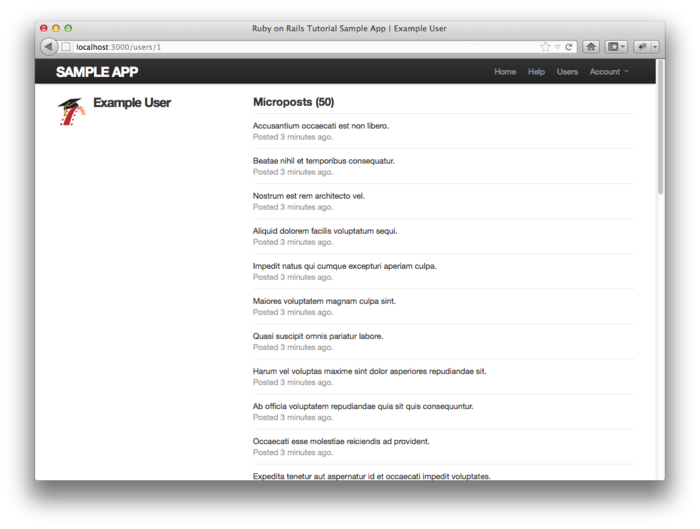

图 10.7：显示了微博的用户资料页面（[/users/1](http://localhost:3000/users/1)）

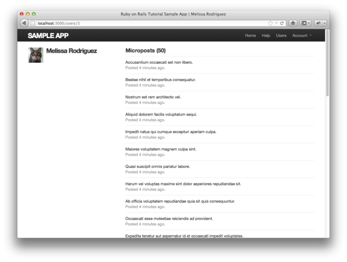

图 10.8：另一个用户的资料页面，也显示了微博列表（[/users/5](http://localhost:3000/users/5)）

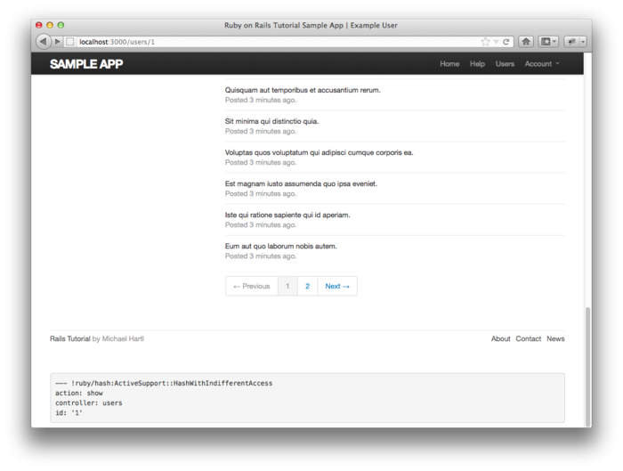

图 10.9：微博分页链接（[/users/1?page=2](http://localhost:3000/users/1?page=2)）

<h2 id="sec-10-3">10.3 微博相关的操作</h2>

微博的数据模型构建好了，也编写了相关的视图文件，接下来我们的开发重点是，通过网页发布微博。在实现的过程中，我们会第三次用到表单来创建资源，这一次创建的是 Microposts 资源<sup>[8](#fn-8)</sup>。本节，我们还会初步实现动态列表（status feed），在[第十一章](chapter11.html)再完善。最后，和 Users 资源类似，我们还要实现在网页中删除微博的功能。

上述功能的实现和之前的惯例有一点是不一样的地方，需要特别注意，那就是：Microposts 资源相关的页面不是通过 Microposts 控制器实现的，而是依赖于 Users 和 StaticPages 控制器。这也就意味着，Microposts 资源的路由设置是很简单的，如代码 10.25 所示。代码 10.25 中的代码所代表的符合 REST 结构的路由如[表格 10.2](#table-10-2) 所示，表中的路由只是[表格 2.3](chapter2.html#table-2-3) 的一部分。不过，路由虽然简化了，但预示着实现的过程需要更高级的技术，而不会减小代码的复杂度。从[第二章](chapter2.html)起我们就十分依赖脚手架，不过现在我们将舍弃脚手架的大部分功能。

**代码 10.25** Microposts 资源的路由设置<br />`config/routes.rb`

```ruby
SampleApp::Application.routes.draw do
  resources :users
  resources :sessions,   only: [:new, :create, :destroy]
  resources :microposts, only: [:create, :destroy]
  .
  .
  .
end
```

<table id="table-2" class="tabular">
  <tbody>
    <tr>
      <th class="align_left"><strong>HTTP 请求</strong></th>
      <th class="align_left"><strong>URI</strong></th>
      <th class="align_left"><strong>动作</strong></th>
      <th class="align_left"><strong>作用</strong></th>
    </tr>
    <tr class="top_bar">
      <td class="align_left"><tt>POST</tt></td>
      <td class="align_left">/microposts</td>
      <td class="align_left"><code>create</code></td>
      <td class="align_left">创建新微博</td>
    </tr>
    <tr>
      <td class="align_left"><tt>DELETE</tt></td>
      <td class="align_left">/microposts/1</td>
      <td class="align_left"><code>destroy</code></td>
      <td class="align_left">删除 id 为 1 的微博</td>
    </tr>
  </tbody>
</table>

表格 10.2：代码 10.25 设置的 Microposts 资源路由

<h3 id="sec-10-3-1">10.3.1 访问限制</h3>

开发 Microposts 资源的第一步，我们要在 Microposts 控制器中实现访问限制。我们要实现的效果很简单：若要访问 `create` 和 `destroy` 动作就要先登录。针对访问限制的 RSpec 测试如代码 10.26 所示。（在 [10.3.4 节](#sec-10-3-4)中，我们还会测试并加入第三层保护措施，确保只有微博的发布者才能删除该微博。）

**代码 10.26** 限制访问 Microposts 资源的测试<br />`spec/requests/authentication_pages_spec.rb`

```ruby
require 'spec_helper'

describe "Authentication" do
  .
  .
  .
  describe "authorization" do

    describe "for non-signed-in users" do
      let(:user) { FactoryGirl.create(:user) }
      .
      .
      .
      describe "in the Microposts controller" do

        describe "submitting to the create action" do
          before { post microposts_path }
          specify { response.should redirect_to(signin_path) }
        end

        describe "submitting to the destroy action" do
          before { delete micropost_path(FactoryGirl.create(:micropost)) }
          specify { response.should redirect_to(signin_path) }
        end
      end
      .
      .
      .
    end
  end
end
```

上述代码没有使用即将实现的网页界面，而是直接在 Microposts 控制器层面操作：如果向 /microposts 发送 POST 请求（`POST microposts_path` 访问的是 `create` 动作），或者向 /microposts/1 发送 DELETE 请求（`delete micropost_path(micropost)` 访问的是 `destroy` 动作），则会转向登录页面——我们在代码 9.14 中就用过这种方法。

我们要先对程序的代码做点重构，然后再加入程序中，让代码 10.26 中的测试通过。在 [9.2.1 节](chapter9.html#sec-9-2-1)中，我们定义了一个名为 `signed_in_user` 的事前过滤器（参见代码 9.12），确保访问相关的动作之前用户要先登录。那时，我们只需要在 Users 控制器中使用这个事前过滤器，但是现在我们在 Microposts 控制器中也要用到，那么我们就把它移到 Sessions 的帮助方法中，如代码 10.27 所示。<sup>[9](#fn-9)</sup>

**代码 10.27** 把 `signed_in_user` 方法移到 Sessions 帮助方法中<br />`app/helpers/sessions_helper.rb`

```ruby
module SessionsHelper
  .
  .
  .
  def current_user?(user)
    user == current_user
  end

  def signed_in_user
    unless signed_in?
      store_location
      redirect_to signin_url, notice: "Please sign in."
    end
  end
  .
  .
  .
end
```

为了避免代码重复，同时还要把 `signed_in_user` 从 Users 控制器中删掉。

加入了代码 10.27 之后，我们就可以在 Microposts 控制器中使用 `signed_in_user` 方法了，因此我们就可以使用代码 10.28 中的事前过滤器来限制访问 `create` 和 `destroy` 动作了。（因为我们没有使用命令行生成 Microposts 控制器文件，因此需要手动创建。）

**代码 10.28** 在 Microposts 控制器中加入访问限制功能<br />`app/controllers/microposts_controller.rb`

```ruby
class MicropostsController < ApplicationController
  before_filter :signed_in_user

  def create
  end

  def destroy
  end
end
```

注意，我们没有明确指定事前过滤器要限制的动作有哪几个，因为默认情况下仅有的两个动作都会被限制。如果我们要加入第三个动作，例如 `index` 动作，未登录的用户可以访问，那么我们就要明确的指定要限制的动作了：

```ruby
class MicropostsController < ApplicationController
  before_filter :signed_in_user, only: [:create, :destroy]

  def index
  end

  def create
  end

  def destroy
  end
end
```

现在，测试应该可以通过了：

```sh
$ bundle exec rspec spec/requests/authentication_pages_spec.rb
```

<h3 id="sec-10-3-2">10.3.2 创建微博</h3>

在[第七章](chapter7.html)中，我们实现了用户注册功能，方法是使用 HTML 表单向 Users 控制器的 `create` 动作发送 POST 请求。创建微博的功能实现起来是类似的，最大的不同点在于，表单不是放在单独的页面 /microposts/new 中，而是在网站的首页（模仿 Twitter，在根地址 [/](http://localhost:3000)），构思图如图 10.10 所示。

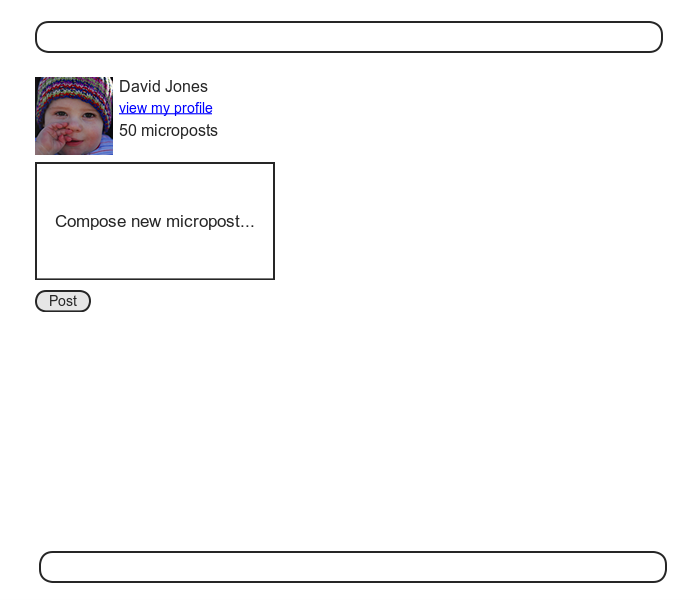

图 10.10：包含创建微博表单的首页构思图

上一次接触首页时，是图 5.6 那个样子，在页面中部有个“Sign up now!”链接按钮。因为创建微博的表单只对登录后的用户有用，所以本节的目标之一就是根据用户的登录状态显示不同的首页内容，如代码 10.31 所示，不过在此之前，我们可以先编写测试。和用户资源一样，我们要使用集成测试：

```sh
$ rails generate integration_test micropost_page
```

对创建微博功能的测试和对创建用户功能的测试（参见代码 7.16）类似，如代码 10.29 所示：

**代码 10.29** 对创建微博功能的测试<br />`spec/requests/micropost_pages_spec.rb`

```ruby
require 'spec_helper'

describe "Micropost pages" do

  subject { page }

  let(:user) { FactoryGirl.create(:user) }
  before { sign_in user }

  describe "micropost creation" do
    before { visit root_path }

    describe "with invalid information" do

      it "should not create a micropost" do
        expect { click_button "Post" }.not_to change(Micropost, :count)
      end

      describe "error messages" do
        before { click_button "Post" }
        it { should have_content('error') }
      end
    end

    describe "with valid information" do

      before { fill_in 'micropost_content', with: "Lorem ipsum" }
      it "should create a micropost" do
        expect { click_button "Post" }.to change(Micropost, :count).by(1)
      end
    end
  end
end
```

下面我们来编写 Microposts 控制器 `create` 动作的代码，和 Users 控制器的有点类似（参见代码 7.25），主要的区别是，创建微博时，要使用用户和微博的关联关系来构建微博对象，如代码 10.30 所示。

**代码 10.30** Microposts 控制器的 `create` 动作<br />`app/controllers/microposts_controller.rb`

```ruby
class MicropostsController < ApplicationController
  before_filter :signed_in_user

  def create
    @micropost = current_user.microposts.build(params[:micropost])
    if @micropost.save
      flash[:success] = "Micropost created!"
      redirect_to root_url
    else
      render 'static_pages/home'
    end
  end

  def destroy
  end
end
```

我们使用代码 10.31 来构建创建微博所需的表单，这个视图会根据用户的登录状态显示不同的 HTML 内容。

**代码 10.31** 在首页中加入创建微博所需的表单<br />`app/views/static_pages/home.html.erb`

```erb
<% if signed_in? %>
  <div class="row">
    <aside class="span4">
      <section>
        <%= render 'shared/user_info' %>
      </section>
      <section>
        <%= render 'shared/micropost_form' %>
      </section>
    </aside>
  </div>
<% else %>
  <div class="center hero-unit">
    <h1>Welcome to the Sample App</h1>

    <h2>
      This is the home page for the
      <a href="http://railstutorial.org/">Ruby on Rails Tutorial</a>
      sample application.
    </h2>

    <%= link_to "Sign up now!", signup_path,
                                class: "btn btn-large btn-primary" %>
  </div>

  <%= link_to image_tag("rails.png", alt: "Rails"), 'http://rubyonrails.org/' %>
<% end %>
```

上述代码中 `if-else` 条件语句的各分支包含的代码太多，有点乱，在练习中（[10.5 节](#sec-10-5)）我们会进行优化，把分支中的代码放入局部视图中。不过代码 10.31 中用到的局部视图不会留作练习，现在就来创建：用户信息侧边栏局部视图如代码 10.32 所示，创建微博的表单局部视图如代码 10.33 所示。

**代码 10.32** 用户信息侧边栏局部视图<br />`app/views/shared/_user_info.html.erb`

```erb
<a href="<%= user_path(current_user) %>">
  <%= gravatar_for current_user, size: 52 %>
</a>
<h1>
  <%= current_user.name %>
</h1>
<span>
  <%= link_to "view my profile", current_user %>
</span>
<span>
  <%= pluralize(current_user.microposts.count, "micropost") %>
</span>
```

和代码 9.25 一样，代码 10.32 使用了代码 7.29 中定义的 `gravatar_for` 帮助方法。

注意，和用户资料页面的侧边栏类似（参见代码 10.20），代码 10.32 中的用户信息也显示了用户发布的微博数量。不过显示上有细微的差别，在用户资料页面的侧边栏中，“Microposts” 是作为标签使用的，所以“Microposts (1)”这样的用法是合理的。而在本例中，如果说“1 microposts”的话就有点不合语法了，所以我们调用了 `pluralize` 方法，显示成“1 micropost”，“2 microposts”等。

下面我们来编写创建微博表单的局部视图，如代码 10.33 所示，和代码 7.17 中的注册表单是类似的。

**代码 10.33** 创建微博表单局部视图<br />`app/views/shared/_micropost_form.html.erb`

```erb
<%= form_for(@micropost) do |f| %>
  <%= render 'shared/error_messages', object: f.object %>
  <div class="field">
    <%= f.text_area :content, placeholder: "Compose new micropost..." %>
  </div>
  <%= f.submit "Post", class: "btn btn-large btn-primary" %>
<% end %>
```

如果要代码 10.33 中的表单可用，我们还要做两件事。第一，（和之前一样）我们要通过关联关系定义 `@micropost` 变量：

```ruby
@micropost = current_user.microposts.build
```

写入控制器后如代码 10.34 所示。

**代码 10.34** 在 `home` 动作中定义 `@micropost` 实例变量<br />`app/controllers/static_pages_controller.rb`

```ruby
class StaticPagesController < ApplicationController

  def home
    @micropost = current_user.microposts.build if signed_in?
  end
  .
  .
  .
end
```

代码 10.34 中的代码有一个好处，如果我们忘记加入要求用户登录的限制，相应的测试会失败。

我们要做的第二件事是，重写错误提示信息局部视图，让 `<%= render 'shared/error_messages', object: f.object %>` 这行代码能正确运行。你可能还记得，在代码 7.22 中，错误提示信息的局部视图代码直接引用了 `@user` 变量，但现在我们提供的变量却是 `@micropost`。因此，我们要编写一个新的错误提示信息局部视图，不管传入的是什么变量，都能正常使用。幸好，表单的块变量 `f` 可以通过 `f.object` 获取当前的对象，因此，在 `form_for(@user) do |f|` 中，`f.object` 的返回值是 `@user`；在 `form_for(@micropost) do |f|` 中，`f.object` 的返回值是 `@micropost`。

我们要通过一个 Hash 把对象传入局部视图，其值是该对象，键是局部视图中所需的变量名称，如下面的代码所示：

```erb
<%= render 'shared/error_messages', object: f.object %>
```

换句话说，`object: f.object` 会创建一个名为 `object` 的变量，供 `error_messages` 局部视图使用。利用这个对象，我们就可以编写不同的错误提示信息，如代码 10.35 所示。

**代码 10.35** 修改代码 7.23 中的错误提示信息局部视图，如果传入其他对象也可以使用<br />`app/views/shared/_error_messages.html.erb`

```erb
<% if object.errors.any? %>
  <div id="error_explanation">
    <div class="alert alert-error">
      The form contains <%= pluralize(object.errors.count, "error") %>.
    </div>
    <ul>
    <% object.errors.full_messages.each do |msg| %>
      <li>* <%= msg %></li>
    <% end %>
    </ul>
  </div>
<% end %>
```

现在，代码 10.29 中的测试应该可以通过了：

```sh
$ bundle exec rspec spec/requests/micropost_pages_spec.rb
```

不过，Users 资源相关视图的 request spec 测试却失败了，因为注册和编辑用户的表单使用的仍是旧的错误提示信息局部视图。要想修正这个错误，就要换用新的局部视图，如代码 10.36 和代码 10.37 所示。（注意：如果你加入了 [9.6 节](chapter9.html#sec-9-6)练习中的代码 9.50 和代码 9.51，那么要修改的代码有点不一样，需要做适当的修改。）

**代码 10.36** 修改用户注册表单的错误提示信息局部视图<br />`app/views/users/new.html.erb`

```erb
<% provide(:title, 'Sign up') %>
<h1>Sign up</h1>

<div class="row">
  <div class="span6 offset3">
    <%= form_for(@user) do |f| %>
      <%= render 'shared/error_messages', object: f.object %>
      .
      .
      .
    <% end %>
  </div>
</div>
```

**代码 10.37** 修改编辑用户表单的错误提示信息局部视图<br />`app/views/users/edit.html.erb`

```erb
<% provide(:title, "Edit user") %>
<h1>Update your profile</h1>

<div class="row">
  <div class="span6 offset3">
    <%= form_for(@user) do |f| %>
      <%= render 'shared/error_messages', object: f.object %>
      .
      .
      .
    <% end %>

    <%= gravatar_for(@user) %>
    <a href="http://gravatar.com/emails">change</a>
  </div>
</div>
```

现在，所有的测试应该都可以通过了：

```sh
$ bundle exec rspec spec/
```

而且，本节添加的所有 HTML 代码也都能正确渲染：图 10.11 中显示了创建微博的表单，图 10.12 中显示了有一个错误提示信息的表单。现在你可以自己发布一篇微博试一下一切是否都可以正常运行，不过最好还是在 [10.3.3 节](#sec-10-3-3)之后再试吧。

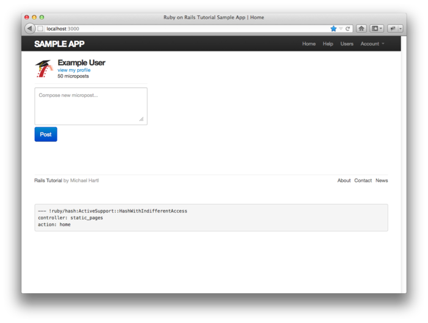

图 10.11：显示有创建微博表单的首页（[/](http://localhost:3000/)）

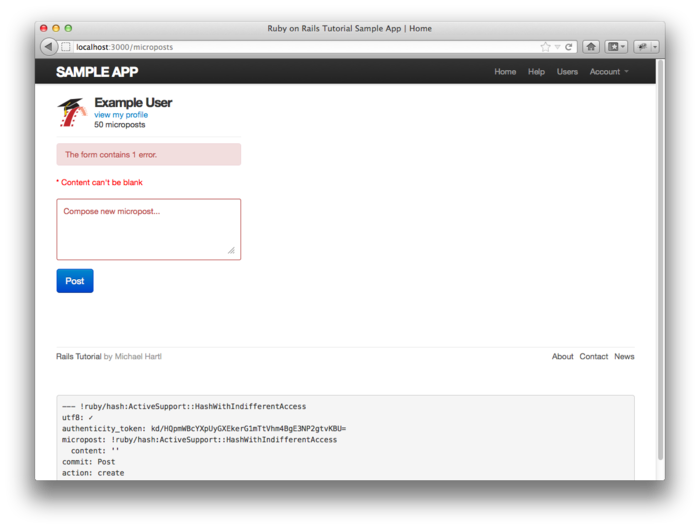

图 10.12：显示有错误提示信息的首页

<h3 id="sec-10-3-3">10.3.3 临时的动态列表</h3>

[10.3.2 节](#sec-10-3-2)遗留了一个功能没有实现：首页没有显示动态。如果你愿意的话，可以在图 10.11 所示的表单中发表一篇合法的微博，然后转到用户资料页面，验证一下这个表单是否可以正常使用。这样在页面之间来来回回是有点麻烦的，如果能在首页显示一个含有当前登入用户的微博列表就好了，构思图如图 10.13 所示。（在[第十一章](chapter11.html)中，我们会在这个微博列表中加入当前登入用户所关注用户的微博。）

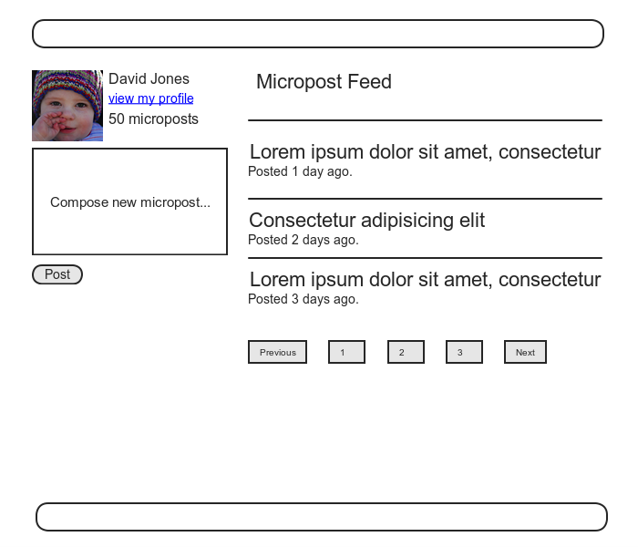

图 10.13：显示有临时动态列表的首页构思图

因为每个用户都应该有一个动态列表，因此我们可以在 User 模型中定义一个名为 `feed` 的方法。等功能全部实现后，我们会测试微博列表中是否包含了所关注用户的微博，不过现在我们只需要测试 `feed` 方法的返回值是否只有当前登入用户的微博，而没有其他用户的微博。测试所需的代码如代码 10.38 所示。

**代码 10.38** 对临时动态列表的测试<br />`spec/models/user_spec.rb`

```ruby
require 'spec_helper'

describe User do
  .
  .
  .
  it { should respond_to(:microposts) }
  it { should respond_to(:feed) }
  .
  .
  .
  describe "micropost associations" do

    before { @user.save }
    let!(:older_micropost) do
      FactoryGirl.create(:micropost, user: @user, created_at: 1.day.ago)
    end
    let!(:newer_micropost) do
      FactoryGirl.create(:micropost, user: @user, created_at: 1.hour.ago)
    end
    .
    .
    .
    describe "status" do
      let(:unfollowed_post) do
        FactoryGirl.create(:micropost, user: FactoryGirl.create(:user))
      end

      its(:feed) { should include(newer_micropost) }
      its(:feed) { should include(older_micropost) }
      its(:feed) { should_not include(unfollowed_post) }
    end
  end
end
```

上述代码，在数组上调用了 `include?` 方法（基于 RSpec 对布尔值方法的约定），该方法的作用是检查数组中是否包含指定的元素：<sup>[10](#fn-10)</sup>

```sh
$ rails console
>> a = [1, "foo", :bar]
>> a.include?("foo")
=> true
>> a.include?(:bar)
=> true
>> a.include?("baz")
=> false
```

这段代码说明了 RSpec 对布尔值方法的约定是多么的灵活，虽然 `include` 是 Ruby 语言的关键字（用来引入模块，在代码 8.14 中有用到），但在当前语境中，RSpec 依然能正确的识别我们的意图是要测试数组是否包含了指定的元素。

在编写 `feed` 方法时，我们需要从数据库中取出所有 `user_id` 等于当前用户 id 的微博，要在 `Micropost` 对象上调用 `where` 方法，如代码 10.39 所示。<sup>[11](#fn-11)</sup>

**代码 10.39** 动态列表的初步实现<br />`app/models/user.rb`

```ruby
class User < ActiveRecord::Base
  .
  .
  .
  def feed
    # This is preliminary. See "Following users" for the full implementation.
    Micropost.where("user_id = ?", id)
  end
  .
  .
  .
end
```

`Micropost.where("user_id = ?", id)` 中的问号可以确保 `id` 的值在传入底层的 SQL 查询语句之前做了适当的转义，避免“SQL 注入”这种严重的安全隐患。这里用到的 `id` 属性是个整数，没什么危险，不过在 SQL 语句中引入变量之前做转义是个好习惯。

细心的读者可能已经注意到了，现阶段代码 10.39 中的代码和下面的定义作用是一样的：

```ruby
def feed
  microposts
end
```

我们之所以使用了代码 10.39 的版本，是因为它能更好的服务于[第十一章](chapter11.html)中实现的完整的动态列表。

要测试动态列表的显示，我们首先要创建一些微博，然后检测各微博在页面中是否均包含在列表元素 `li` 中，如代码 10.40 所示。

**代码 10.40** 测试首页显示的微博列表<br />`spec/requests/static_pages_spec.rb`

```ruby
require 'spec_helper'

describe "Static pages" do

  subject { page }

  describe "Home page" do
    .
    .
    .
    describe "for signed-in users" do
      let(:user) { FactoryGirl.create(:user) }
      before do
        FactoryGirl.create(:micropost, user: user, content: "Lorem ipsum")
        FactoryGirl.create(:micropost, user: user, content: "Dolor sit amet")
        sign_in user
        visit root_path
      end

      it "should render the user's feed" do
        user.feed.each do |item|
          page.should have_selector("li##{item.id}", text: item.content)
        end
      end
    end
  end
  .
  .
  .
end
```

代码 10.40 假设显示的每篇微博都有唯一的 CSS id，所以如下代码

```ruby
page.should have_selector("li##{item.id}", text: item.content)
```

会为每个微博生成一个匹配器。（注意，`li##{item.id}` 中的第一个 `#` 是 Capybara 中的对应 CSS id 的句法，而第二个 `#` 则代表 Ruby 字符串插值操作 `#{}` 的开始。）

要在示例程序中使用动态列表，我们可以在 `home` 动作中定义一个 `@feed_items` 实例变量，如代码 10.41 所示。然后再在首页中（参见代码 10.44）加入一个动态列表局部视图（参见代码 10.42）。（对分页的测试会留作练习，参见 [10.5 节](#sec-10-5)。）

**代码 10.41** 在 `home` 动作中加入一个实例变量<br />`app/controllers/static_pages_controller.rb`

```ruby
class StaticPagesController < ApplicationController

  def home
    if signed_in?
      @micropost  = current_user.microposts.build
      @feed_items = current_user.feed.paginate(page: params[:page])
    end
  end
  .
  .
  .
end
```

**代码 10.42** 动态列表局部视图<br />`app/views/shared/_feed.html.erb`

```erb
<% if @feed_items.any? %>
  <ol class="microposts">
    <%= render partial: 'shared/feed_item', collection: @feed_items %>
  </ol>
  <%= will_paginate @feed_items %>
<% end %>
```

动态列表局部视图使用如下代码，把列表项目的渲染支配给了 `feed_item` 局部视图：

```erb
<%= render partial: 'shared/feed_item', collection: @feed_items %>
```

我们传入了一个名为 `:collection` 的参数，其值为 `@feed_items`，这样 `render` 方法就会在指定的局部视图中（本例中的 `feed_item`）使用这个集合中的数据渲染各项目。（之前，在渲染局部视图时，我们都省略了 `:partial` 参数，例如 `render 'shared/micropost'`，不过如果指定了 `:collection` 参数，这种省略的用法就是错误的。）列表项目局部视图的代码如代码 10.43 所示。

**代码 10.43** 渲染单个动态列表项目的局部视图<br />`app/views/shared/_feed_item.html.erb`

```erb
<li id="<%= feed_item.id %>">
  <%= link_to gravatar_for(feed_item.user), feed_item.user %>
  <span class="user">
    <%= link_to feed_item.user.name, feed_item.user %>
  </span>
  <span class="content"><%= feed_item.content %></span>
  <span class="timestamp">
    Posted <%= time_ago_in_words(feed_item.created_at) %> ago.
  </span>
</li>
```

代码 10.43 还使用如下的代码为每个动态项目指定了 CSS id：

```erb
<li id="<%= feed_item.id %>">
```

这正是代码 10.40 中的测试所要检测的。

和之前一样，我们可以把动态列表局部视图加入首页来显示动态，如代码 10.44 所示。加入后的效果就是在首页显示了动态列表，和预期一样，如图 10.14 所示。

**代码 10.44** 在首页中加入动态列表<br />`app/views/static_pages/home.html.erb`

```erb
<% if signed_in? %>
  <div class="row">
    .
    .
    .
    <div class="span8">
      <h3>Micropost Feed</h3>
      <%= render 'shared/feed' %>
    </div>
  </div>
<% else %>
  .
  .
  .
<% end %>
```

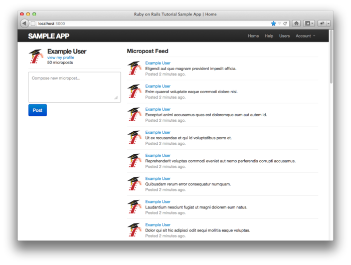

图 10.14：显示了临时动态列表的首页（[/](http://localhost:3000/)）

现在，发布新微博的功能可以按照预期正常工作了，如图 10.15 所示。不过还有个小小不足：如果发布微博失败，首页还会需要一个名为 `@feed_items` 的实例变量，所以提交失败时网站就无法正常运行了（你也可以运行测试来验证一下）。最简单的解决方法是，如果提交失败就把 `@feed_items` 设为空数组，如代码 10.45 所示。<sup>[12](#fn-12)</sup>

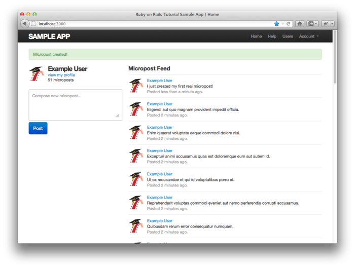

图 10.15：发布新微博后的首页

**代码 10.45** 在 `create` 动作加入一个空的 `@feed_items` 实例变量<br />`app/controllers/microposts_controller.rb`

```ruby
class MicropostsController < ApplicationController
  .
  .
  .
  def create
    @micropost = current_user.microposts.build(params[:micropost])
    if @micropost.save
      flash[:success] = "Micropost created!"
      redirect_to root_url
    else
      @feed_items = []
      render 'static_pages/home'
    end
  end
  .
  .
  .
end
```

至此，临时的动态列表可以正常工作了，测试组件也可以通过了：

```sh
$ bundle exec rspec spec/
```

<h3 id="sec-10-3-4">10.3.4 删除微博</h3>

我们要为 Microposts 资源实现的最后一个功能是删除微博。和删除用户类似（参见 [9.4.2 节](chapter9.html#sec-9-4-2)），删除微博也是通过“delete”链接实现的，构思图如图 10.16 所示。删除用户要限制只有管理员才能进行，而删除微博的链接只对微博的发布者可用。

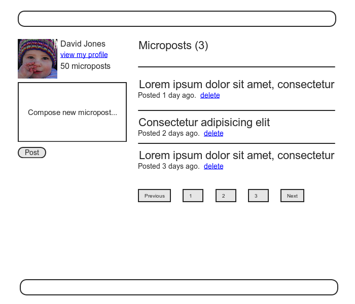

图 10.16：显示有删除链接的临时动态列表构思图

第一步，我们要在微博局部视图（代码 10.21）中加入删除链接，同时还要在动态列表项目的局部视图（代码 10.43）中加入类似的链接，结果如代码 10.46 和代码 10.47 所示。（这两个局部视图基本上是一样的，消除代码重复会留作练习，参见 [10.5 节](#sec-10-5)。）

**代码 10.46** 在微博局部视图中加入删除链接<br />`app/views/microposts/_micropost.html.erb`

```erb
<li>
  <span class="content"><%= micropost.content %></span>
  <span class="timestamp">
    Posted <%= time_ago_in_words(micropost.created_at) %> ago.
  </span>
  <% if current_user?(micropost.user) %>
    <%= link_to "delete", micropost, method: :delete,
                                     data: { confirm: "You sure?" },
                                     title: micropost.content %>
  <% end %>
</li>
```

**代码 10.47** 在动态列表项目局部视图中加入删除链接<br />`app/views/shared/_feed_item.html.erb`

```erb
<li id="<%= feed_item.id %>">
  <%= link_to gravatar_for(feed_item.user), feed_item.user %>
    <span class="user">
      <%= link_to feed_item.user.name, feed_item.user %>
    </span>
    <span class="content"><%= feed_item.content %></span>
    <span class="timestamp">
      Posted <%= time_ago_in_words(feed_item.created_at) %> ago.
    </span>
  <% if current_user?(feed_item.user) %>
    <%= link_to "delete", feed_item, method: :delete,
                                     data: { confirm: "You sure?" },
                                     title: feed_item.content %>
  <% end %>
</li>
```

对删除微博的测试要用 Capybara 来点击“delete”链接，然后检测微博的数量是否减少了一个，如代码 10.48 所示。

**代码 10.48** 针对 Microposts 控制器 `destroy` 动作的测试<br />`spec/requests/micropost_pages_spec.rb`

```ruby
require 'spec_helper'

describe "Micropost pages" do
  .
  .
  .
  describe "micropost destruction" do
    before { FactoryGirl.create(:micropost, user: user) }

    describe "as correct user" do
      before { visit root_path }

      it "should delete a micropost" do
        expect { click_link "delete" }.to change(Micropost, :count).by(-1)
      end
    end
  end
end
```

程序所需的代码还是和代码 9.48 中删除用户时类似，两种情况的主要不同之处是，删除微博不使用 `admin_user` 事前过滤器了，而是用 `correct_user` 事前过滤器，检查当前用户是否发布了指定 id 的微博，如代码 10.49 所示。图 10.17 显示的是删除了倒数第二个微博后的页面。

**代码 10.49** Microposts 控制器的 `destroy` 动作<br />`app/controllers/microposts_controller.rb`

```ruby
class MicropostsController < ApplicationController
  before_filter :signed_in_user, only: [:create, :destroy]
  before_filter :correct_user,   only: :destroy
  .
  .
  .
  def destroy
    @micropost.destroy
    redirect_to root_url
  end

  private

    def correct_user
      @micropost = current_user.microposts.find_by_id(params[:id])
      redirect_to root_url if @micropost.nil?
    end
end
```

注意，在 `correct_user` 事前过滤器中，我们是通过关联关系查寻微博的：

```ruby
current_user.microposts.find_by_id(params[:id])
```

这行代码可以自行确保只在当前用户发布的微博中查询。这里，我们使用的是 `find_by_id`，而没用 `find`，因为如果没有找到微博 `find` 会抛出异常，而不会返回 `nil`。顺便说一下，如果你习惯处理 Ruby 异常，也可以按照下面的方式定义 `correct_user` 过滤器：

```ruby
def correct_user
  @micropost = current_user.microposts.find(params[:id])
rescue
  redirect_to root_url
end
```

你可能会说，我们也可以直接使用 `Micropost` 对象来实现 `correct_user` 过滤器，就像下面这样：

```ruby
@micropost = Micropost.find_by_id(params[:id])
redirect_to root_url unless current_user?(@micropost.user)
```

这种实现方式基本上和代码 10.49 是一样的，不过，[Wolfram Arnold](http://www.rubyfocus.biz/) 在《[Access Control 101 in Rails and the Citibank Hack](http://www.rubyfocus.biz/blog/2011/06/15/access_control_101_in_rails_and_the_citibank-hack.html)》一文中解释过，安全起见，最好还是通过关联来查找。

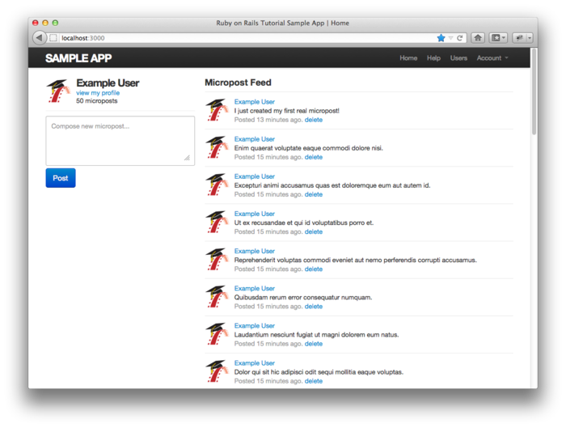

图 10.17：删除了倒数第二篇微博后的首页

加入了本节的代码后，我们的 Micropost 模型以及用户界面就都完成了，测试组件也可以通过了：

```sh
$ bundle exec rspec spec/
```

<h2 id="sec-10-4">10.4 小结</h2>

加入了 Microposts 资源后，我们的示例程序基本上完成了。还没实现的部分是社交功能，让用户之间可以相互关注。在[第十一章](chapter11.html)中我们会学习如何实现这种关联关系，还要实现一个真正的动态列表。

如果你使用 Git 做版本控制的话，在继续之前，先提交改动，然后再合并到主分支：

```sh
$ git add .
$ git commit -m "Add user microposts"
$ git checkout master
$ git merge user-microposts
$ git push
```

现在你也可以把程序推送到 Heroku 上。因为加入 `microposts` 表改动了数据模型，因此你需要在“生产数据库”中执行迁移操作：

```sh
$ git push heroku
$ heroku pg:reset <DATABASE>
$ heroku run rake db:migrate
$ heroku run rake db:populate
```

按照 [9.5 节](chapter9.html#sec-9-5)中的说明，把上面第二个命令中的 `DATABASE` 换成适当的值。


<h2 id="sec-10-5">10.5 练习</h2>

到目前为止，我们已经实现了很多功能，在现有功能的基础上我们还可以实现更多的功能，下面就是一些例子。

1. 添加测试，检测侧边栏中微博的数量是否正确显示了，要包含对单复数的检查。

2. 添加测试，检测微博的分页功能。

3. 重构首页的视图文件，把 `if-else` 语句的两个分支分别放到单独的局部视图中。

4. 编写一个测试，确保不是当前用户发布的微博下方不会显示删除链接。

5. 使用局部视图去掉代码 10.46 和代码 10.47 中的重复。

6. 现在，特别长的单词会撑破布局，如图 10.18 所示。使用代码 10.50 中定义的 `wrap` 帮助方法修正这个错误。注意，其中用到的 `raw` 方法是为了避免 Rails 转义 HTML 代码，`sanitize` 方法是为了防止跨站脚本攻击。这段代码还用到了看起来很奇怪但是很实用的三元操作符（ternary operator，参见[旁注 10.1](#box-10-1) 的说明）。

7. （**附加题**）在首页中添加一段 JavaScript 代码，当在发布微博的表单中输入文字时，显示输入的内容与 140 个字符的差值。

<div id="box-10-1" class="aside">
  <h4>旁注 10.1：三种人</h4>
  <p>世界上有三种人：一种喜欢用三元操作符，一种不喜欢，还有一种甚至不知道三元操作符是什么。（如果你不幸是第三种人的话，看过下面的说明就不再归属其中了。）</p>
  <p>在编写很多代码之后，你会发现最常用到的流程控制是类似下面这种：</p>
  <pre>if boolean?
  do_one_thing
else
  do_something_else
end</pre>
  <p>Ruby 和其他很多语言一样（包括 C/C++，Perl，PHP 和 Java），提供了一种更为简单的表达式来替换这种流程控制结构——三元操作符（之所以起了这个名字，是因为三元操作符涉及三个部分）：</p>
  <pre>boolean? ? do_one_thing : do_something_else</pre>
  <p>三元操作符甚至可以用来替代赋值操作：</p>
  <pre>if boolean?
  var = foo
else
  var = bar
end</pre>
  <p>可以改写成</p>
  <pre>var = boolean? ? foo : bar</pre>
  <p>另外一个经常使用地方是在函数的返回值中：</p>
  <pre>def foo
  do_stuff
  boolean? ? "bar" : "baz"
end</pre>
  <p>因为 Ruby 函数的默认返回值是定义体中的最后一个表达式，所以 <code>foo</code> 方法的返回值会根据 <code>boolean?</code> 的结果而不同，不是 <code>"bar"</code> 就是 <code>"baz"</code>。代码 10.50 中就用到了这种结构。</p>
</div>

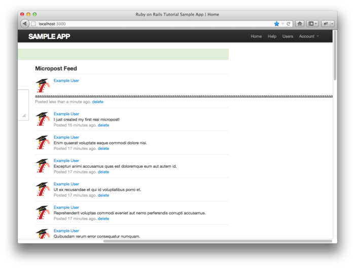

图 10.18：特别长的单词撑破了网站的布局

**代码 10.50** 换行显示长单词的帮助方法<br />`app/helpers/microposts_helper.rb`

```ruby
module MicropostsHelper

  def wrap(content)
    sanitize(raw(content.split.map{ |s| wrap_long_string(s) }.join(' ')))
  end

  private

    def wrap_long_string(text, max_width = 30)
      zero_width_space = "&#8203;"
      regex = /.{1,#{max_width}}/
      (text.length < max_width) ? text :
                                  text.scan(regex).join(zero_width_space)
    end
end
```

<div class="navigation">
  <a class="prev_page" href="{{ site.url }}/chapter9.html">&laquo; 第九章 更新、显示和删除用户</a>
  <a class="next_page" href="{{ site.url }}/chapter11.html">第十一章 关注用户 &raquo;</a>
</div>

1. 严格来说，我们在[第八章](chapter8.html)中是把 session 当做资源来处理的，不过 session 不会像 Users 和 Microposts 资源那样被存入数据库。
2. `content` 属性是字符串（`string`）类型，不过我们曾在 [2.1.2 节](chapter2.html#sec-2-1-2)中简要介绍过，较长的文本应该使用 `text` 类型。
3. 一开始我忘了复制微博的属性，导致本书第一版中的这个测试有点问题。这里我们加入了安全检查，避免再犯相同的错误。感谢火眼金睛的读者 Jacob Turino 发现了这个错误，让我注意到了这个问题。
4. 例如自定义了头像的 5 个用户和 使用 Gravatar 默认头像的 1 个用户。
5. 如果你对这个方法生成的 SQL 感兴趣，可以查看 `log/development.log` 文件。
6. Faker 中的 lorem ipsum 文本是被设计为随机生成的，所以你的示例微博可能和我的不一样。
7. 为了行文方便，代码 10.24 实际上包含了本章用到的所有 CSS。
8. 另外两个资源分别是 [7.2 节](chapter7.html#sec-7-2) 中的 Users 资源和 [8.1 节](chapter8.html#sec-8-1)中的 Sessions 资源。
9. 我们在 [8.2.1 节](chapter8.html#sec-8-2-1)中介绍过，默认情况下帮助方法只能在视图中使用，因此要在控制器中使用 Sessions 帮助方法就要在 Application 控制器中加入代码 `include SessionHelper`。
10. 我之所以在 [1.1.1 节](chapter1.html#sec-1-1-1)中推荐读者在读完本书后阅读一本纯介绍 Ruby 的书，就是为了学习使用类似 `include?` 这样的方法。
11. 阅读 Rails 指南中的《[Active Record Query Interface](http://guides.rubyonrails.org/active_record_querying.html)》一文，更深入的学习 `where` 等方法的用法。
12. 很不幸，这样的话分页就不可用了。你可以加入分页，点击分页链接看一下是为什么。
