这一章主要介绍两种非常典型的、不同的图像描述子，这两种图像描述子的使用将贯穿于本书，并且作为重要的局部特征，它们应用到了很多应用领域，比如创建全景图、增强现实、3维重建等。

<h2 id="sec-2-1">2.1 Harris角点检测</h2>

Harris角点检测算法是最简单的角点检测方法之一。关于harris算法的原理，可以参阅本书中译本。下面是harris角点检测实例代码。

```python
# -*- coding: utf-8 -*-
from pylab import *
from PIL import Image
from PCV.localdescriptors import harris

"""
Example of detecting Harris corner points (Figure 2-1 in the book).
"""

# 读入图像
im = array(Image.open('../data/empire.jpg').convert('L'))

# 检测harris角点
harrisim = harris.compute_harris_response(im)

# Harris响应函数
harrisim1 = 255 - harrisim

figure()
gray()

#画出Harris响应图
subplot(141)
imshow(harrisim1)
print harrisim1.shape
axis('off')
axis('equal')

threshold = [0.01, 0.05, 0.1]
for i, thres in enumerate(threshold):
    filtered_coords = harris.get_harris_points(harrisim, 6, thres)
    subplot(1, 4, i+2)
    imshow(im)
    print im.shape
    plot([p[1] for p in filtered_coords], [p[0] for p in filtered_coords], '*')
    axis('off')

#原书采用的PCV中PCV harris模块
#harris.plot_harris_points(im, filtered_coords)

# plot only 200 strongest
# harris.plot_harris_points(im, filtered_coords[:200])

show()
```
运行上面代码，可得原书P32页的图:

在上面代码中，先代开一幅图像，将其转换成灰度图像，然后计算相响应函数，通过响应值选择角点。最后，将这些检测的角点在原图上显示出来。如果你想对角点检测方法做一个概览，包括想对Harris检测器做些提高或改进，可以参阅WIKI中的例子[WIKI](http://en.wikipedia.org/wiki/Corner_detection).

<h3 id="sec-2-1-2">2.1.2 在图像间寻找对应点</h3>

Harris角点检测器可以给出图像中检测到兴趣点，但它并没有提供在图像间对兴趣点进行比较的方法，我们需要在每个角点添加描述子，以及对这些描述子进行比较。关于兴趣点描述子，见本书中译本。下面再现原书P35页中的结果：

```python
 # -*- coding: utf-8 -*-
from pylab import *
from PIL import Image

from PCV.localdescriptors import harris
from PCV.tools.imtools import imresize

"""
This is the Harris point matching example in Figure 2-2.
"""

# Figure 2-2上面的图
#im1 = array(Image.open("../data/crans_1_small.jpg").convert("L"))
#im2= array(Image.open("../data/crans_2_small.jpg").convert("L"))

# Figure 2-2下面的图
im1 = array(Image.open("../data/sf_view1.jpg").convert("L"))
im2 = array(Image.open("../data/sf_view2.jpg").convert("L"))

# resize加快匹配速度
im1 = imresize(im1, (im1.shape[1]/2, im1.shape[0]/2))
im2 = imresize(im2, (im2.shape[1]/2, im2.shape[0]/2))

wid = 5
harrisim = harris.compute_harris_response(im1, 5)
filtered_coords1 = harris.get_harris_points(harrisim, wid+1)
d1 = harris.get_descriptors(im1, filtered_coords1, wid)

harrisim = harris.compute_harris_response(im2, 5)
filtered_coords2 = harris.get_harris_points(harrisim, wid+1)
d2 = harris.get_descriptors(im2, filtered_coords2, wid)

print 'starting matching'
matches = harris.match_twosided(d1, d2)

figure()
gray() 
harris.plot_matches(im1, im2, filtered_coords1, filtered_coords2, matches)
show()
```
运行上面代码，可得下图：


正如你从上图所看到的，这里有很多错配的。近年来，提高特征描述点检测与描述有了很大的发展，在下一节我们会看这其中最好的算法之一——SIFT。

<h2 id="sec-2-2">2.2 sift描述子</h2>

在过去的十年间，最成功的图像局部描述子之一是尺度不变特征变换(SIFT),它是由David Lowe发明的。SIFT在2004年由Lowe完善并经受住了时间的考验。关于SIFT原理的详细介绍，可以参阅中译本，在[WIKI](http://en.wikipedia.org/wiki/Scale-invariant_feature_transform)上你可以看一个简要的概览。下面代码是再现原书P40页的代码：

```python
# -*- coding: utf-8 -*-
from PIL import Image
from pylab import *
from PCV.localdescriptors import sift
from PCV.localdescriptors import harris

# 添加中文字体支持
from matplotlib.font_manager import FontProperties
font = FontProperties(fname=r"c:\windows\fonts\SimSun.ttc", size=14)

imname = '../data/empire.jpg'
im = array(Image.open(imname).convert('L'))
sift.process_image(imname, 'empire.sift')
l1, d1 = sift.read_features_from_file('empire.sift')

figure()
gray()
subplot(131)
sift.plot_features(im, l1, circle=False)
title(u'SIFT特征',fontproperties=font)
subplot(132)
sift.plot_features(im, l1, circle=True)
title(u'用圆圈表示SIFT特征尺度',fontproperties=font)

# 检测harris角点
harrisim = harris.compute_harris_response(im)

subplot(133)
filtered_coords = harris.get_harris_points(harrisim, 6, 0.1)
imshow(im)
plot([p[1] for p in filtered_coords], [p[0] for p in filtered_coords], '*')
axis('off')
title(u'Harris角点',fontproperties=font)

show()
```
运行上面代码，可得下图：
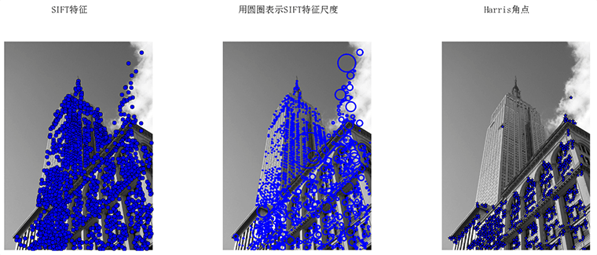
为了将sift和Harris角点进行比较，将Harris角点检测的显示在了图像的最后侧。正如你所看到的，这两种算法选择了不同的坐标。

<h2 id="sec-2-2-1">2.2.1 描述子匹配</h2>

下面代码是再现原书P43页的代码：

```python
# -*- coding: utf-8 -*-
from PIL import Image
from pylab import *
import sys
from PCV.localdescriptors import sift


if len(sys.argv) >= 3:
  im1f, im2f = sys.argv[1], sys.argv[2]
else:
  im1f = '../data/sf_view1.jpg'
  im2f = '../data/sf_view2.jpg'
#  im1f = '../data/crans_1_small.jpg'
#  im2f = '../data/crans_2_small.jpg'
#  im1f = '../data/climbing_1_small.jpg'
#  im2f = '../data/climbing_2_small.jpg'
#im1 = array(Image.open(im1f).convert('L'))
#im2 = array(Image.open(im2f).convert('L'))
im1 = array(Image.open(im1f))
im2 = array(Image.open(im2f))

sift.process_image(im1f, 'out_sift_1.txt')
l1, d1 = sift.read_features_from_file('out_sift_1.txt')
figure()
gray()
#sift.plot_features(im1, l1, circle=True)
sift.plot_features(im1, l1, circle=False)

sift.process_image(im2f, 'out_sift_2.txt')
l2, d2 = sift.read_features_from_file('out_sift_2.txt')
figure()
gray()
#sift.plot_features(im2, l2, circle=True)
sift.plot_features(im2, l2, circle=False)

#matches = sift.match(d1, d2)
matches = sift.match_twosided(d1, d2)
print '{} matches'.format(len(matches.nonzero()[0]))

figure()
gray()
#sift.plot_matches(im1, im2, l1, l2, matches, show_below=False)
sift.plot_matches(im1, im2, l1, l2, matches, show_below=True)
show()
```
运行上面代码，可得下图：
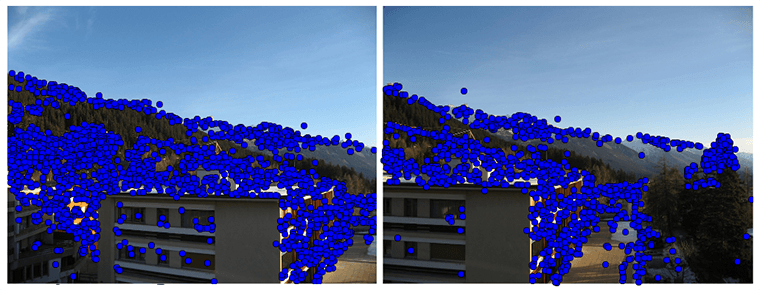
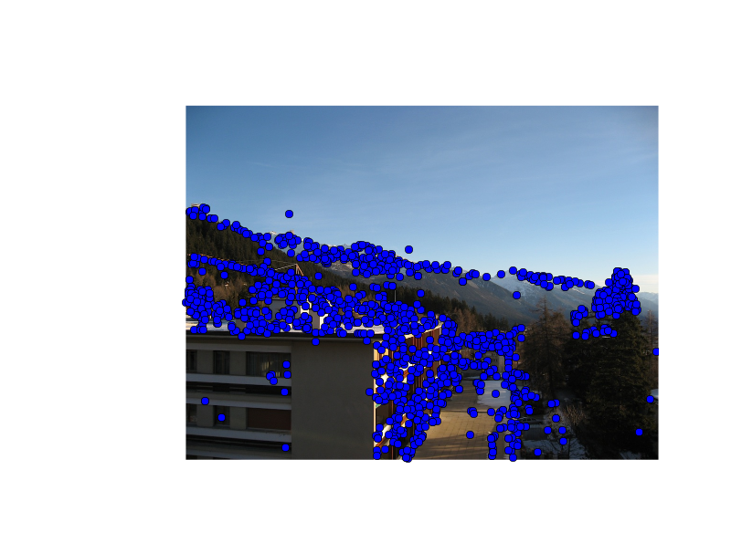
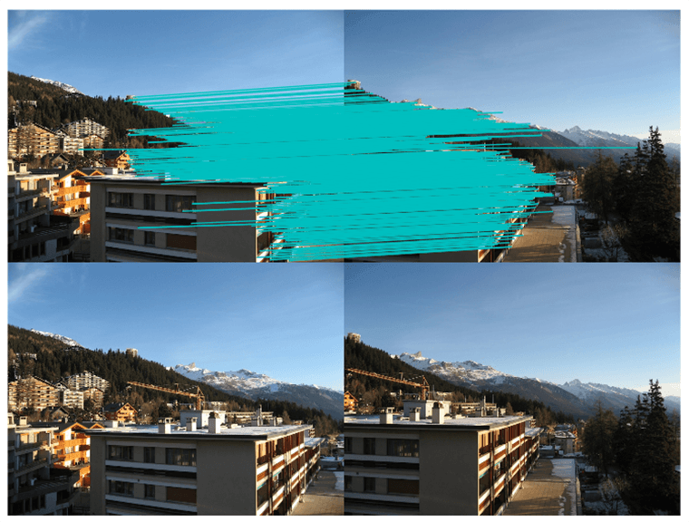


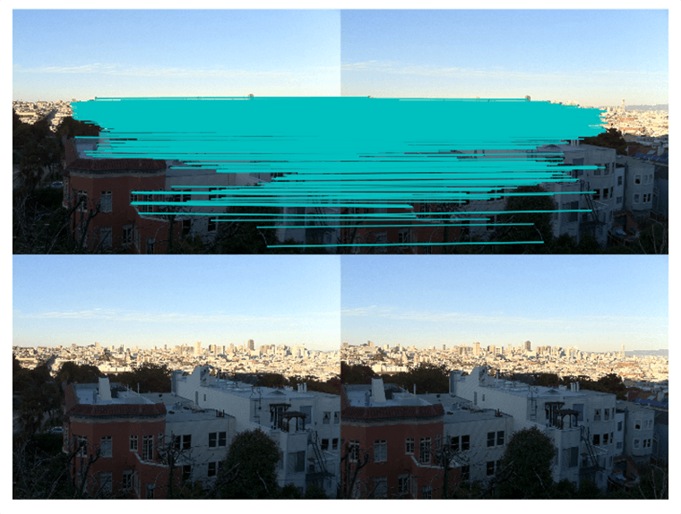


本章我们要开发一个简单的演示应用程序来展示一下 Rails 强大的功能。我们会使用脚手架（scaffold）功能快速的生成程序，这样就能以一定的高度概览一下 Ruby on Rails 编程的过程（也能大致的了解一下 Web 开发）。正如在第一章的[旁注 1.1](chapter1.html#box-1-1) 中所说，本书将采用另一种方法，我们会循序渐进的开发程序，遇到新的概念都会详细说明，不过为了概览功能（也为了寻找成就感）也无需对脚手架避而不谈。我们可以通过 URI 和最终的演示程序进行交互，了解一下 Rails 应用程序的结构，也第一次演示 Rails 使用的 REST 架构。

和后面的大型示例程序类似，这个演示程序将包含用户（users）和微博（microposts）两个模型（因此实现了一个小型的 Twitter 类程序）。程序的功能还需要后续的开发，而且开发过程中的很多步骤看起来也很神秘，不过暂时不用担心：从第三章起将从零开始再开发一个类似的程序，我还会提供大量的资料供后续参考。你要有些耐心，不要怕多犯错误，本章的主要目的就是让你不要被脚手架的神奇迷惑住了，而要更深入的了解 Rails。

<h2 id="sec-2-1">2.1 规划程序</h2>

在这一节我们要规划一下这个演示程序。和 [1.2.3 节](chapter1.html#sec-1-2-3)类似，我们先使用 `rails` 命令生成程序的骨架。

```sh
$ cd ~/rails_projects
$ rails new demo_app
$ cd demo_app
```

然后我们用一个文本编辑器修改 `Gemfile`，写入代码 2.1 所示的代码。

**代码 2.1** 演示程序的 `Gemfile`

```ruby
source 'https://rubygems.org'

gem 'rails', '3.2.13'

group :development do
  gem 'sqlite3', '1.3.5'
end


# Gems used only for assets and not required
# in production environments by default.
group :assets do
  gem 'sass-rails',   '3.2.5'
  gem 'coffee-rails', '3.2.2'

  gem 'uglifier', '1.2.3'
end

gem 'jquery-rails', '2.0.2'

group :production do
  gem 'pg', '0.12.2'
end
```

代码 2.1 除了增加 Heroku 生产环境需要的 gem 外，其他的内容和代码 1.5 是一样的：

```ruby
group :production do
  gem 'pg', '0.12.2'
end
```

`pg` 是用来连接 [PostgreSQL](http://www.postgresql.org/) 数据库的，Heroku 使用这个数据库。

然后使用 `bundle install` 命令安装并包含这些 gem：

```sh
$ bundle install --without production
```

`--without production` 选项指明不安装生产环境所需的 gem，这里只有 `pg` 是生产环境所需的。（如果 Bundler 提示：

```text
no such file to load -- readline (LoadError)
```

试一下把 `gem 'rb-readline'` 加入 `Gemfile`。）

最后我们还要把演示程序纳入版本控制。提醒一下，`rails` 命令会生成一个默认的 `.gitignore` 文件，不过对于你所使用的系统而言代码 1.7 中的代码似乎更有用。然后初始化一个 Git 仓库，做第一次提交：

```sh
$ git init
$ git add .
$ git commit -m "Initial commit"
```

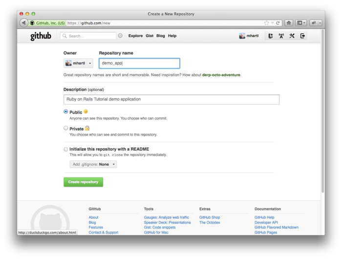

图 2.1：为演示程序在 GitHub 新建一个仓库

你可以重新创建一个仓库然后将代码推送到 GitHub：

```sh
$ git remote add origin git@github.com:<username>/demo_app.git
$ git push -u origin master
```

（和第一章中的程序一样，注意不要使用 GitHub 自动生成的 `README` 文件初始化仓库。）

下面要开发这个程序了。开发 Web 应用程序一般来说第一步是创建数据模型（data model），模型代表应用程序所需的结构。对我们这个程序而言，它是个轻博客，有用户和微博。那么我们先为程序创建一个用户（users）模型（[2.1.1 节](#sec-2-1-1)），然后再添加微博（microposts）模型（[2.1.2 节](#sec-2-1-2)）。

<h3 id="sec-2-1-1">2.1.1 用户模型</h3>

不同的注册表单代表了不同的用户数据模型，我们将选择一种简化的模型。这个演示程序的用户要有一个唯一的标识符 `id`（整数 `integer`），一个对外显示的名字 `name`（字符串 `string`），还有一个 Email 地址 `email`（字符串 `string`），它将同时兼任用户名。用户模型的结构如图 2.2。


图 2.2：用户数据模型

我们会在 [6.1.1 节](chapter6.html#sec-6-1-1)中介绍，图 2.2 中的标签 `users` 代表数据库中的一个表，`id`、`name` 和 `email` 是表中的列。

<h3 id="sec-2-1-2">2.1.2 微博模型</h3>

微博数据模型的核心比用户的模型还要简单：微博要有一个 `id` 和一个内容 `content`（字符串 `string`）。<sup>[1](#fn-1)</sup> 不过还有一个比较复杂的数据要实现：将微博和用户关联起来，我们使用 `user_id` 来存储微博的拥有者。最终的数据模型如图 2.3。


图 2.3：微博的数据模型

在 [2.3.3 节](#sec-2-3-3)中我们会看到怎样使用 `user_id` 字段简单的实现一个用户拥有多个微博的功能（[第十章](chapter10.html)会做更详尽的介绍）。

<h2 id="sec-2-2">2.2 Users 资源（users resource）</h2>

本节我们将要实现 [2.1.1 节](#sec-2-1-1)中设定的用户数据模型，还会为这个模型创建基于网页的界面。这二者结合起来就是一个“Users 资源”，“资源”的意思是将用户设想为对象，可以通过 HTTP 协议在网页中创建（create）、读取（read）、更新（update）和删除（delete）。正如前面提到的，我们的 Users 资源会使用脚手架功能生成，Rails 内置了这样的功能。我强烈建议你先不要细看生成的代码，在这个时候看只会让你更困惑。

将 `scaffold` 传递给 `rails generate` 就可以使用 Rails 的脚手架功能了。传给 `scaffold` 的参数是资源名的单数形式（本例中就是 `User`），后面可以再跟着指定数据模型的字段：<sup>[2](#fn-2)</sup>

```sh
$ rails generate scaffold User name:string email:string
      invoke  active_record
      create    db/migrate/20111123225336_create_users.rb
      create    app/models/user.rb
      invoke    test_unit
      create      test/unit/user_test.rb
      create      test/fixtures/users.yml
       route  resources :users
      invoke  scaffold_controller
      create    app/controllers/users_controller.rb
      invoke    erb
      create      app/views/users
      create      app/views/users/index.html.erb
      create      app/views/users/edit.html.erb
      create      app/views/users/show.html.erb
      create      app/views/users/new.html.erb
      create      app/views/users/_form.html.erb
      invoke    test_unit
      create      test/functional/users_controller_test.rb
      invoke    helper
      create      app/helpers/users_helper.rb
      invoke      test_unit
      create        test/unit/helpers/users_helper_test.rb
      invoke  assets
      invoke    coffee
      create      app/assets/javascripts/users.js.coffee
      invoke    scss
      create      app/assets/stylesheets/users.css.scss
      invoke  scss
      create    app/assets/stylesheets/scaffolds.css.scss
```

上面代码中的命令加入了 `name:string` 和 `email:string`，这样我们就可以实现如图 2.2 所示的用户模型了。（注意没必要指定 `id`，Rails 会自动创建并将其设为表的主键（primary key）。）

接下来我们要用 Rake（参见[旁注 2.1](#box-2-1)）来迁移（migrate）数据库：

```sh
$ bundle exec rake db:migrate
==  CreateUsers: migrating ====================================================
-- create_table(:users)
   -> 0.0017s
==  CreateUsers: migrated (0.0018s) ===========================================
```

上面的命令会使用新定义的 User 数据模型更新数据库。（在 [6.1.1 节](chapter6.html#sec-6-1-1)中将详细介绍数据库迁移）注意，为了使用 `Gemfile` 中指定的 Rake 版本，我们通过 `bundle exec` 来执行 `rake`。

然后我们可以使用 `rails s`（`rails server` 的缩略形式）来启动本地服务器：

```sh
$ rails s
```

现在演示程序应该已经可以通过 <http://localhost:3000/> 查看了。

<div id="box-2-1" class="aside">
	<h4>旁注 2.1 Rake</h4>
	<p>在 Unix 中，在将源码编译成可执行程序的过程中，<a href="http://en.wikipedia.org/wiki/Make_(software)">make</a> 组件起了很重要的作用。很多程序员的身体甚至已经对下面的代码产生了条件反射</p>
	<pre>$ ./configure &amp;&amp; make &amp;&amp; sudo make install</pre>
	<p>这行代码在 Unix 中（包括 Linux 和 Mac OS X）会对代码进行编译。</p>
	<p>Rake 就是 Ruby 版的 make，用 Ruby 编写的类 make 程序。Rails 灵活的运用了 Rake 的功能，特别是提供了一些用来开发基于数据库的 Web 程序所需的任务。<code>rake db:migrate</code> 是最常用的了，还有很多其他的命令，你可以运行 <code>rake -T db</code> 来查看所有和数据库有关的任务：</p>
	<pre>$ bundle exec rake -T db</pre>
	<p>如果要查看所有的 Rake 任务，运行</p>
	<pre>$ bundle exec rake -T</pre>
	<p>任务列表看起来有点让人摸不着头脑，不过现在无需担心，你不需要知道所有的（或大多数）命令。学完本教程后你会知道所有重要的命令。</p>
</div>

<h3 class="sec-2-2-1">2.2.1 浏览用户相关的页面</h3>

访问根地址 <http://localhost:3000/> 得到的还是如图 1.3 所示的 Rails 程序默认页面，不过使用脚手架生成 Users 资源的时候也生成了很多用来处理用户的页面。例如，列出所有用户的页面地址是 [/users](http://localhost:3000/users)，创建新用户的地址是 [/users/new](http://localhost:3000/users/new)。本节的目的就是走马观花的浏览一下这些用户相关的页面。浏览的时候你会发现表格 2.1 很有用，表中显示了页面和 URI 地址之间的对应关系。

<table class="tabular">
	<tbody>
		<tr>
			<th class="align_left"><strong>URI</strong></th>
			<th class="align_left"><strong>动作（Action）</strong></th>
			<th class="align_left"><strong>目的</strong></th>
		</tr>
		<tr class="top_bar">
			<td class="align_left"><a href="http://localhost:3000/users">/users</a></td>
			<td class="align_left"><code>index</code></td>
			<td class="align_left">显示所有用户的页面</td>
		</tr>
		<tr>
			<td class="align_left"><a href="http://localhost:3000/users/1">/users/1</a></td>
			<td class="align_left"><code>show</code></td>
			<td class="align_left">显示 ID 为 <code>1</code> 的用户的页面</td>
		</tr>
		<tr>
			<td class="align_left"><a href="http://localhost:3000/users/new">/users/new</a></td>
			<td class="align_left"><code>new</code></td>
			<td class="align_left">创建新用户的页面</td>
		</tr>
		<tr>
			<td class="align_left"><a href="http://localhost:3000/users/1/edit">/users/1/edit</a></td>
			<td class="align_left"><code>edit</code></td>
			<td class="align_left">编辑 ID 为 <code>1</code> 的用户的页面</td>
		</tr>
	</tbody>
</table>

表格 2.1：Users 资源中页面和 URI 的对应关系

我们先来看一下显示所有用户的页面，叫做“index”，如你所想，目前还没有用户存在。（如图 2.4）

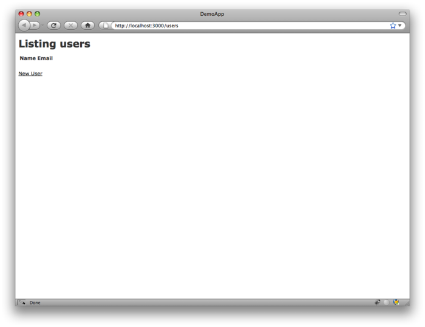

图 2.4：Users 资源的初始索引页面（[/users](http://localhost:3000/users)）

如果想创建新用户就要访问“new”页面，如图 2.5 所示。（在本地开发时，地址的前面部分都是 http://localhost:3000，因此在后面的内容中我会省略这一部分）在第七章中我们会将其改造成用户注册页面。

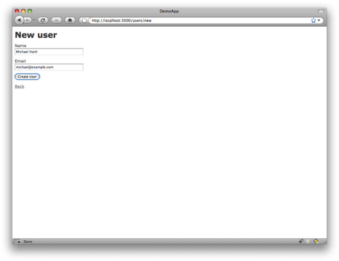

图2.5：创建新用户的页面（[/users/new](http://localhost:3000/users/new)）

你可以在表格中填入名字和 Email 地址，然后点击创建用户（Create User）按钮来创建一个用户。然后就会显示这个用户的页面（`show`），如图 2.6 所示。（页面中的绿色文字是通过 Flash 消息实现的，会在 [7.4.2 节](chapter7.html#sec-7-4-2)中介绍）注意页面的地址是 [/users/1](http://localhost:3000/users/1)，正如你猜想的，这里的 `1` 就是图 2.2 中的用户 `id`。在 [7.1 节](chapter7.html#sec-7-1) 中会将其打造成用户的资料页面。

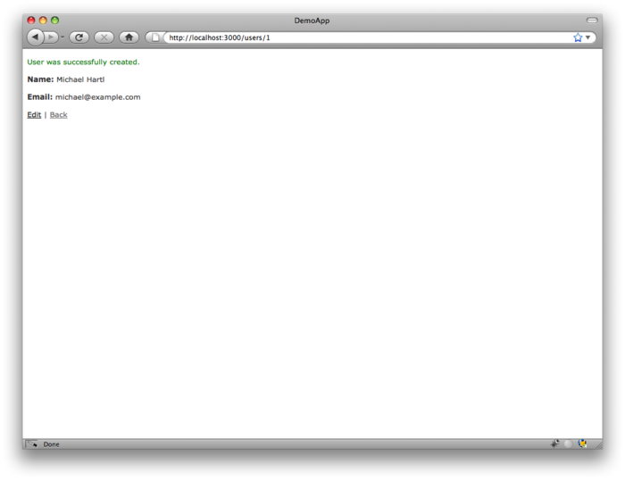

图 2.6：显示某个用户的页面（[/users/1](http://localhost:3000/users/1)）

如果要修改用户的信息就要访问编辑（edit）页面了（如图 2.7）。修改用户的信息后点击“更新用户（Update User）”按钮就更改了演示程序中该用户的信息（如图 2.8）。（在[第六章](chapter6.html)我们会看到，用户的数据存储在后端的数据库中。）我们会在 [9.1 节](chapter9.html#sec-9-1)中添加编辑和更新用户的功能。

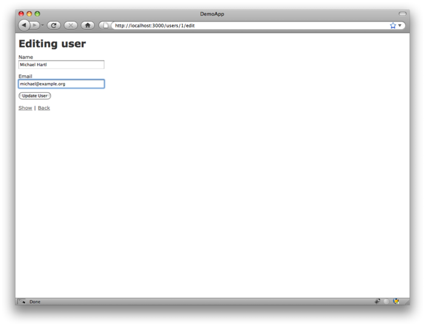

图 2.7：编辑用户的页面（[/users/1/edit](http://localhost:3000/users/1/edit)）

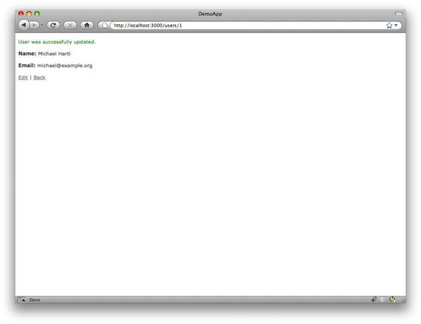

图 2.8：显示“信息已更新”提示的用户页面

现在我们重新回到创建新用户页面，然后提交表格创建第二个用户。然后访问用户索引（index）页面（如图 2.9）。[7.1 节](chapter7.html#sec-7-1)将美化一下这个显示所有用户的页面。

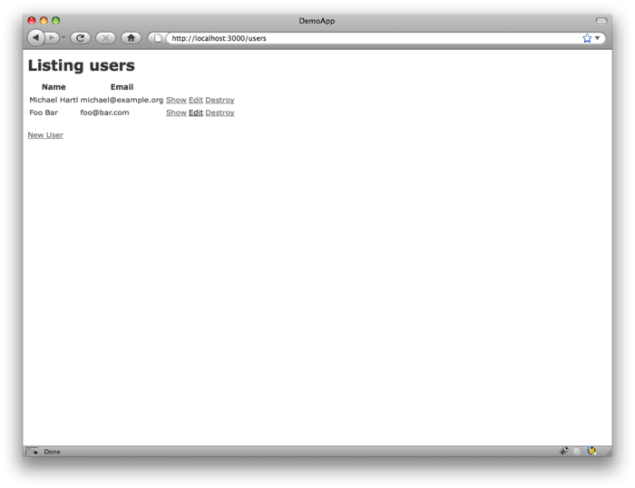

图 2.9：显示了第二个用户的用户索引页面（[/users](http://localhost:3000/users)）

我们已经演示了创建、展示、编辑用户的页面，下面要演示销毁用户页面了（如图 2.10）。点击图 2.10 中的链接会出现一个验证对话框，确认后就会删除第二个用户，索引页面就只会显示一个用户。（如果这个操作没有顺利完成，请确保浏览器启用了 JavaScript 支持。销毁用户时 Rails 是通过 JavaScript 发送请求的。）[9.4 节](chapter9.html#sec-9-4)会增强用户的删除功能，只有管理员级别的用户才能删除用户。

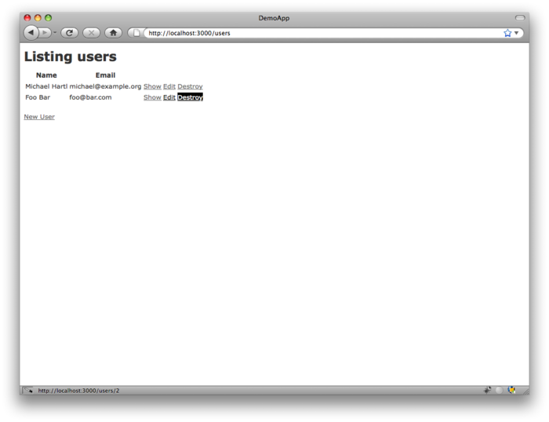

图 2.10：销毁用户

<h3 id="sec-2-2-2">2.2.2 MVC 实践</h3>

我们已经大概的浏览了 Users 资源，下面我们要用 [1.2.6 节](chapter1.html#sec-1-2-6)中介绍的 MVC 的视角来仔细的看一下其中某些特定的部分。我们会分析在浏览器中做一次点击的内在过程，这里通过访问用户索引页面做演示，来了解一下 MVC。（如图 2.11）

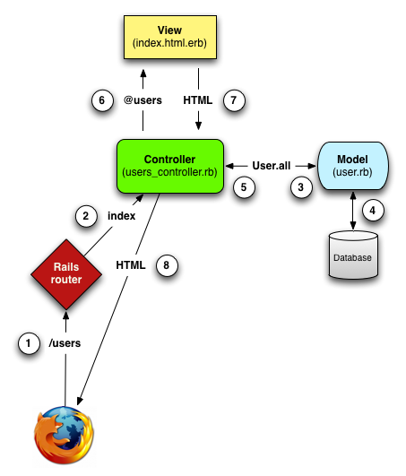

图 2.11：Rails 中 MVC 的详细说明图解

1. 浏览器向 /users 发起一个请求；
1. Rails 的路由将 /user 分配到 Users 控制器的 `index` 动作；
1. `index` 动作向 User 模型获取所有的用户（`User.all`）；
1. User 模型从数据库中将所有的用户读取出来；
1. User 模型将所有的用户返回给控制器；
1. 控制器将获得的所有用户数据赋予 `@users` 变量，然后传递给 `index` 的视图；
1. 视图使用内嵌 Ruby 代码的模板渲染成 HTML；
1. 控制器将生成的 HTML 发送回浏览器。<sup>[3](#fn-3)</sup>

首先我们要从浏览器中发起一个请求，你可以直接在浏览器地址栏中敲入地址，也可以点击页面中的链接。（图 2.11 中的第 1 步）接着请求到达 Rails 路由（第 2 步），根据 URI 将其分发到适当的控制器动作（而且还会考量请求的类型，[旁注 3.2](chapter3.html#box-3-2) 中会介绍）。将 Users 资源中相关的 URI 映射到控制器动作的代码如代码 2.2 所示。这些代码会按照表格 2.1 中的对应关系做映射。（`:users` 是一个 Symbol，[4.3.3 节](chapter4.html#sec-4-3-3)会介绍）

**代码 2.2** Rails 的路由设置，包含一条 Users 资源的规则 <br />`config/routes.rb`

```ruby
DemoApp::Application.routes.draw do
  resources :users
  .
  .
  .
end
```

[2.2.1 节](#sec-2-2-1)中浏览的页面就对应了 Users 控制器中不同的动作。脚手架生成的控制器代码大致如代码 2.3 所示。注意一下 `class UsersController < ApplicationController` 的用法，这是 Ruby 中类继承的写法。（[2.3.4 节](#sec-2-3-4)中将简要的介绍一下继承，[4.4 节](chapter4.html#sec-4-4)将详细介绍类和继承。）

**代码 2.3** 用户控制器的代码概要 <br />`app/controllers/users_controller.rb`

```ruby
class UsersController < ApplicationController

  def index
    .
    .
    .
  end

  def show
    .
    .
    .
  end

  def new
    .
    .
    .
  end

  def create
    .
    .
    .
  end

  def edit
    .
    .
    .
  end

  def update
    .
    .
    .
  end

  def destroy
    .
    .
    .
  end
end
```

或许你发现了动作的数量比我们看过的页面数量要多，`index`、`show`、`new` 和 `edit` 对应了 [2.2.1 节](#sec-2-2-1)中介绍的页面。不过还有一些其他的动作，`create`、`update` 和 `destroy` 等，这些动作一般不会直接渲染页面（不过有时也会），它们只会修改数据库中保存的用户数据。表格 2.2 列出的是控制器的全部动作，这些动作就是 Rails 对 REST 架构（参见[旁注 2.2](#box-2-2)）的实现。REST 是由计算机科学家 [Roy Fielding](http://en.wikipedia.org/wiki/Roy_Fielding) 提出的概念，意思是表现层状态转化（Representational State Transfer）。<sup>[4](#fn-4)</sup> 注意表格 2.2 中的内容，有些部分是有重叠的。例如 `show` 和 `update` 两个动作都映射到 /users/1 这个地址上。二者的区别是它们所用的 [HTTP 请求方法](http://en.wikipedia.org/wiki/HTTP_request#Request_methods)不同。[3.2.1 节](chapter3.html#sec-3-2-1)将更详细的介绍 HTTP 请求方法。

<table id="table-2-2" class="tabular">
	<tbody>
		<tr>
			<th class="align_left"><strong>HTTP 请求</strong></th>
			<th class="align_left"><strong>URI</strong></th>
			<th class="align_left"><strong>动作</strong></th>
			<th class="align_left"><strong>目的</strong></th>
		</tr>
		<tr class="top_bar">
			<td class="align_left"><tt>GET</tt></td>
			<td class="align_left">/users</td>
			<td class="align_left"><code>index</code></td>
			<td class="align_left">显示所用用户的页面</td>
		</tr>
		<tr>
			<td class="align_left"><tt>GET</tt></td>
			<td class="align_left">/users/1</td>
			<td class="align_left"><code>show</code></td>
			<td class="align_left">显示 ID 为 <code>1</code> 的用户页面</td>
		</tr>
		<tr>
			<td class="align_left"><tt>GET</tt></td>
			<td class="align_left">/users/new</td>
			<td class="align_left"><code>new</code></td>
			<td class="align_left">创建新用户的页面</td>
		</tr>
		<tr>
			<td class="align_left"><tt>POST</tt></td>
			<td class="align_left">/users</td>
			<td class="align_left"><code>create</code></td>
			<td class="align_left">创建新用户</td>
		</tr>
		<tr>
			<td class="align_left"><tt>GET</tt></td>
			<td class="align_left">/users/1/edit</td>
			<td class="align_left"><code>edit</code></td>
			<td class="align_left">编辑 ID 为 <code>1</code> 的用户页面</td>
		</tr>
		<tr>
			<td class="align_left"><tt>PUT</tt></td>
			<td class="align_left">/users/1</td>
			<td class="align_left"><code>update</code></td>
			<td class="align_left">更新 ID 为 <code>1</code> 的用户</td>
		</tr>
		<tr>
			<td class="align_left"><tt>DELETE</tt></td>
			<td class="align_left">/users/1</td>
			<td class="align_left"><code>destroy</code></td>
			<td class="align_left">删除 ID 为 <code>1</code> 的用户</td>
		</tr>
	</tbody>
</table>

表格 2.2：代码 2.2 中 Users 资源生成的符合 REST 架构的路由

<div id="box-2-2" class="aside">
	<h4>旁注 2.2：表现层状态转化（REST）</h4>
	<p>如果你阅读过一些 Ruby on Rails Web 开发相关的资料，你会看到很多地方都提到了“REST”，它是“表现层状态转化（REpresentational State Transfer）”的简称。REST 是一种架构方式，用来开发分布式、基于网络的系统和程序，例如 WWW 和 Web 应用程序。REST 理论是很抽象的，在 Rails 程序中，REST 意味着大多数的组件（例如用户和微博）会被模型化，变成资源（resource），可以被创建（create）、读取（read）、更新（update）和删除（delete），这些操作会与<a href="http://en.wikipedia.org/wiki/Create,_read,_update_and_delete">关系型数据库中的 CRUD 操作</a>和 <a href="http://en.wikipedia.org/wiki/HTTP_request#Request_methods">HTTP 请求方法</a>（<tt>POST</tt>，<tt>GET</tt>，<tt>PUT</tt> 和 <tt>DELETE</tt>）对应起来。（<a href="chapter3.html#sec-3-2-1">3.2.1 节</a>，特别是<a href="chapter3.html#box-3-2">旁注 3.2</a>，将更详细的介绍 HTTP 请求）</p>
	<p>作为 Rails 程序开发者，REST 开发方式会帮助你决定编写哪些控制器和动作：你只需简单的将可以创建、读取、更新和删除的资源理清就可以了。对本章的用户和微博来说，这一过程非常明确，因为它们都是很自然的资源形式。在<a href="chapter11.html">第十一章</a>中将看到 REST 架构允许我们将一个很棘手的问题（“关注用户”功能）通过一种自然而便捷的方式处理。</p>
</div>

为了解释 Users 控制器和 User 模型之间的关系，我们要看一下简化了的 `index` 动作的代码，如代码 2.4 所示。（脚手架生成的代码很粗糙，所以我们做了简化）

**代码 2.4** 演示程序中被简化了的用户 `index` 动作 <br />`app/controllers/users_controller.rb`

```ruby
class UsersController < ApplicationController

  def index
    @users = User.all
  end
  .
  .
  .
end
```

`index` 动作有一行代码是 `@users = User.all`（图 2.11 中的第 3 步），它要求 User 模型从数据库中取出所有的用户（第 4 步），然后将结果赋值给 `@users` 变量（第 5 步）。User 模型的代码参见代码 2.5。代码看似简单，不过它通过继承具备了很多功能（参见 [2.3.4 节](#sec-2-3-4) 和 [4.4 节](chapter4.html#sec-4-4)）。简单来说就是通过调用 Rails 中叫做 Active Record 的库，代码 2.5 中的 `User.all` 就会返回所有的用户。（我们会在 [6.1.2 节](chapter6.html#sec-6-1-2)中介绍 `attr_accessible`。注意这一行不会在 Rails 3.2.2 或之前的版本中出现。）

**代码 2.5** 演示程序中的 User 模型 <br />`app/models/user.rb`

```ruby
class User < ActiveRecord::Base
  attr_accessible :email, :name
end
```

一旦定义了 `@users` 变量，控制器就会调用视图代码（第 6 步），其代码如代码 2.6 所示。以 `@` 开头的变量是“实例变量（instance variable）”，在视图中自动可用。在本例中，`index.html.erb` 视图的代码会遍历 `@users`，为每个用户生成一行 HTML。（记住，你现在可能读不懂这些代码，这里只是让你看一下这些代码是什么样子。）

**代码 2.6** 用户索引页面的视图代码 <br />`app/views/users/index.html.erb`

```erb
<h1>Listing users</h1>

<table>
  <tr>
    <th>Name</th>
    <th>Email</th>
    <th></th>
    <th></th>
    <th></th>
  </tr>

<% @users.each do |user| %>
  <tr>
    <td><%= user.name %></td>
    <td><%= user.email %></td>
    <td><%= link_to 'Show', user %></td>
    <td><%= link_to 'Edit', edit_user_path(user) %></td>
    <td><%= link_to 'Destroy', user, method: :delete,
                                     data: { confirm: 'Are you sure?' } %></td>
  </tr>
<% end %>
</table>

<br />

<%= link_to 'New User', new_user_path %>
```

视图会将代码转换成 HTML（第 7 步），然后控制器将其返回浏览器显示出来（第 8 步）。

<h3 id="sec-2-2-3">2.2.3 上述 Users 资源的缺陷</h3>

脚手架生成的 User 资源相关代码虽然能够让你大致的了解一下 Rails，不过它也有一些缺陷：

- **没有对数据进行验证（validation）。**User 模型会接受空的名字和不合法的 Email 地址而不会报错。
- **没有用户身份验证机制（authentication）。**没有实现登录和退出功能，随意一个用户都可以进行任何的操作。
- **没有测试。**也不是完全没有，脚手架会生成一些基本的测试，不过很粗糙也不灵便，没有对数据进行验证，不包含验证机制的测试，以及其他的需求。
- **没有布局。**没有共用的样式和网站导航。
- **没有真正的被理解。**如果你能读懂脚手架生成的代码就不需要阅读本书了。

<h2 id="sec-2-3">2.3 Microposts 资源（microposts resource）</h2>

我们已经生成也浏览了 Users 资源，现在要生成 Microposts 资源了。阅读本节时我推荐你和 [2.2 节](#sec-2-2)对比一下，你会看到两个资源在很多方面都是一致的。通过这样重复的生成资源我们可以更好的理解 Rails 中的 REST 架构。在这样的早期阶段看一下 Users 资源和 Microposts 资源的相同之处也是本章的主要目的之一。（后面我们会看到，开发一个比本章的演示程序复杂的程序要付出很多汗水，Microposts 资源在第十章才会用到，而我不想这么晚才介绍。）

<h3 id="sec-2-3-1">2.3.1 概览 Microposts 资源</h3>

和 Users 资源一样，我们使用 `rails generate scaffold` 命令生成 Microposts 资源的代码，实现图 2.3 中所示的数据模型：<sup>[5](#fn-5)</sup>

```sh
$ rails generate scaffold Micropost content:string user_id:integer
      invoke  active_record
      create    db/migrate/20111123225811_create_microposts.rb
      create    app/models/micropost.rb
      invoke    test_unit
      create      test/unit/micropost_test.rb
      create      test/fixtures/microposts.yml
       route  resources :microposts
      invoke  scaffold_controller
      create    app/controllers/microposts_controller.rb
      invoke    erb
      create      app/views/microposts
      create      app/views/microposts/index.html.erb
      create      app/views/microposts/edit.html.erb
      create      app/views/microposts/show.html.erb
      create      app/views/microposts/new.html.erb
      create      app/views/microposts/_form.html.erb
      invoke    test_unit
      create      test/functional/microposts_controller_test.rb
      invoke    helper
      create      app/helpers/microposts_helper.rb
      invoke      test_unit
      create        test/unit/helpers/microposts_helper_test.rb
      invoke  assets
      invoke    coffee
      create      app/assets/javascripts/microposts.js.coffee
      invoke    scss
      create      app/assets/stylesheets/microposts.css.scss
      invoke  scss
   identical    app/assets/stylesheets/scaffolds.css.scss
```

然后要更新数据库，使用最新的数据模型，我们要执行类似 [2.2 节](#sec-2-2)中用到的迁移命令：

```sh
$ bundle exec rake db:migrate
==  CreateMicroposts: migrating ===============================================
-- create_table(:microposts)
   -> 0.0023s
==  CreateMicroposts: migrated (0.0026s) ======================================
```

现在我们就可以使用类似 [2.2.1 节](#sec-2-2-1)中介绍的方法来创建微博了。就像你猜测的，脚手架也会更新 Rails 的路由文件，为 Microposts 资源加入一条规则，如代码 2.7 所示。<sup>[6](#fn-6)</sup> 和 Users 资源一样，`resources :micropsts` 会将微博相关的 URI 地址映射到 Microposts 控制器，如[表格 2.3](#table-2-3) 所示。

**代码 2.7** Rails 的路由配置，有一条针对 Microposts 资源的新规则 <br />`config/routes.rb`

```ruby
DemoApp::Application.routes.draw do
  resources :microposts
  resources :users
  .
  .
  .
end
```

<table id="table-2-3" class="tabular">
	<tbody>
		<tr>
			<th class="align_left"><strong>HTTP 请求</strong></th>
			<th class="align_left"><strong>URI</strong></th>
			<th class="align_left"><strong>动作</strong></th>
			<th class="align_left"><strong>目的</strong></th>
		</tr>
		<tr class="top_bar">
			<td class="align_left"><tt>GET</tt></td>
			<td class="align_left">/microposts</td>
			<td class="align_left"><code>index</code></td>
			<td class="align_left">显示所有微博的页面</td>
		</tr>
		<tr>
			<td class="align_left"><tt>GET</tt></td>
			<td class="align_left">/microposts/1</td>
			<td class="align_left"><code>show</code></td>
			<td class="align_left">显示 ID 为 <code>1</code> 的微博页面</td>
		</tr>
		<tr>
			<td class="align_left"><tt>GET</tt></td>
			<td class="align_left">/microposts/new</td>
			<td class="align_left"><code>new</code></td>
			<td class="align_left">显示创建新微博的页面</td>
		</tr>
		<tr>
			<td class="align_left"><tt>POST</tt></td>
			<td class="align_left">/microposts</td>
			<td class="align_left"><code>create</code></td>
			<td class="align_left">创建新微博</td>
		</tr>
		<tr>
			<td class="align_left"><tt>GET</tt></td>
			<td class="align_left">/microposts/1/edit</td>
			<td class="align_left"><code>edit</code></td>
			<td class="align_left">编辑 ID 为 <code>1</code> 的微博页面</td>
		</tr>
		<tr>
			<td class="align_left"><tt>PUT</tt></td>
			<td class="align_left">/microposts/1</td>
			<td class="align_left"><code>update</code></td>
			<td class="align_left">更新 ID 为 <code>1</code> 的微博</td>
		</tr>
		<tr>
			<td class="align_left"><tt>DELETE</tt></td>
			<td class="align_left">/microposts/1</td>
			<td class="align_left"><code>destroy</code></td>
			<td class="align_left">删除 ID 为<code>1</code> 的微博</td>
		</tr>
	</tbody>
</table>

表格 2.3：代码 2.7 中 Microposts 资源生成的符合 REST 架构的路由

Microposts 控制器的代码简化后如代码 2.8 所示。注意，除了将 `UsersController` 换成 `MicropostsController` 之外，这段代码和代码 2.3 没什么区别。这说明了这两个资源在 REST 架构中的共同之处。

**代码 2.8** Microposts 控制器的代码简化形式 <br />`app/controllers/microposts_controller.rb`

```ruby
class MicropostsController < ApplicationController

  def index
    .
    .
    .
  end

  def show
    .
    .
    .
  end

  def new
    .
    .
    .
  end

  def create
    .
    .
    .
  end

  def edit
    .
    .
    .
  end

  def update
    .
    .
    .
  end

  def destroy
    .
    .
    .
  end
end
```

我们在创建微博页面（[/microposts/new](http://localhost:3000/microposts/new)）输入一些内容来添加一个微博，如图 2.12 所示。


图 2.12：创建微博的页面（[/microposts/new](http://localhost:3000/microposts/new)）

既然已经在这个页面了，那就多创建几个微博，确保至少有一个微博的 `user_id` 设为了 `1`，这样就对应到 [2.2.1 节](#sec-2-2-1)中创建的第一个用户了。结果应该和图 2.13 类似。

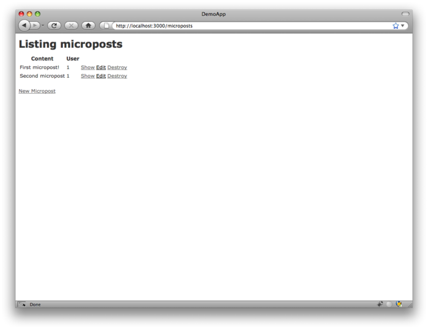

图 2.13：微博索引页面（[/microposts](http://localhost:3000/microposts)）

<h3 id="sec-2-3-2">2.3.2 限制微博内容的长度</h3>

如果要称得上微博这样的名字就要限制其内容的长度。在 Rails 中实现这种限制很简单，使用数据验证（validation）功能。要限制微博的长度最大为 140 个字符（就像 Twitter 一样），我们可以使用长度限制数据验证。现在你可以用你的文本编辑器或 IDE 打开 `app/models/micropost.rb` 写入代码 2.9 所示的代码。（代码 2.9 中使用的 `validates` 方法只针对 Rails 3；如果你之前用过 Rails 2.3，就可以对比一下它和 `validates_length_of` 的区别。）

**代码 2.9** 现在微博的长度最长为 140 个字符 <br />`app/models/micropost.rb`

```ruby
class Micropost < ActiveRecord::Base
  attr_accessible :content, :user_id
  validates :content, :length => { :maximum => 140 }
end
```

上面的代码看起来可能很神秘，我们会在 [6.2 节](chapter6.html#sec-6-2)中详细介绍数据验证。如果我们在创建微博页面输入超过 140 个字符的内容就会看到这个验证的样子了。如图 2.14 所示，Rails 会显示一个错误提示信息（error message）提示微博的内容太长了。（[7.3.2 节](chapter7.html#sec-7-3-2)将更详细的介绍错误信息）

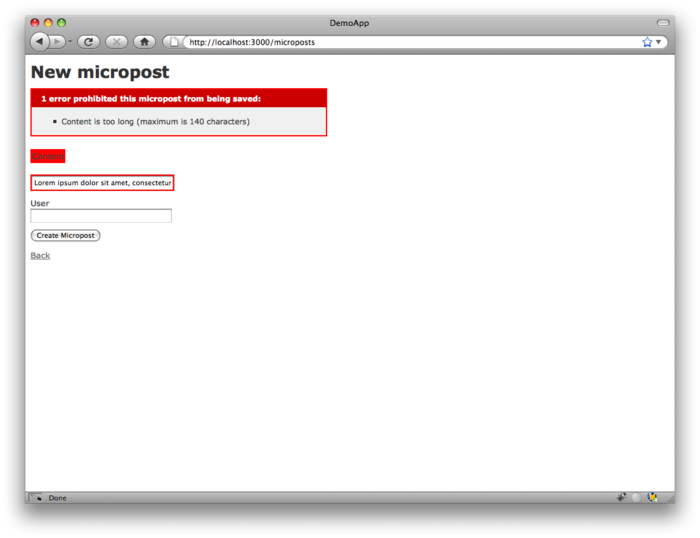

图 2.14：创建微博失败后显示的错误信息

<h3 id="sec-2-3-3">2.3.3 一个用户有多篇（<code>has_many</code>）微博</h3>

Rails 强大的功能之一是可以为不同的数据模型之间创建关联（association）。针对本例中的 User 模型，每个用户可以有多篇微博。我们可以通过更新 User 模型（参见代码 2.10）和 Micropost 模型（参见代码 2.11）的代码来实现这种关联。

**代码 2.10** 一个用户有多篇微博 <br />`app/models/user.rb`

```ruby
class User < ActiveRecord::Base
  attr_accessible :email, :name
  has_many :microposts
end
```

**代码 2.11** 一篇微博只属于一个用户 <br />`app/models/micropost.rb`

```ruby
class Micropost < ActiveRecord::Base
  attr_accessible :content, :user_id

  belongs_to :user

  validates :content, :length => { :maximum => 140 }
end
```

我们可以将这种关联用图 2.15 所示的图形表示出来。因为 `microposts` 表中有 `user_id` 这一列，所以 Rails（通过 Active Record）就可以将微博和每个用户关联起来。


图 2.15：微博和用户之间的关联

在[第十章](chapter10.html)和[第十一章](chapter11.html)中，我们将使用用户和微博之间的关联来显示某一个用户的所有微博，并且生成一个和 Twitter 类似的动态列表。我们可以使用控制台（console）来检查一下用户与微博之间关联的实现，控制台是和 Rails 应用程序交互很有用的工具。在命令行中执行 `rails console` 来启动控制台，然后使用 `User.first` 从数据库中读取第一个用户（并将读取的数据赋值给 `first_user` 变量）：<sup>[7](#fn-7)</sup>

```sh
$ rails console
>> first_user = User.first
=> #<User id: 1, name: "Michael Hartl", email: "michael@example.org",
created_at: "2011-11-03 02:01:31", updated_at: "2011-11-03 02:01:31">
>> first_user.microposts
=> [#<Micropost id: 1, content: "First micropost!", user_id: 1, created_at:
"2011-11-03 02:37:37", updated_at: "2011-11-03 02:37:37">, #<Micropost id: 2,
content: "Second micropost", user_id: 1, created_at: "2011-11-03 02:38:54",
updated_at: "2011-11-03 02:38:54">]
>> exit
```

（上面代码中我包含了最后一行用来演示如何退出控制台，在大多数系统中也可以使用 Ctrl-d 组合键。）然后使用 `first_user.microposts` 获取用户的微博：Active Record 会自动返回 `user_id` 和 `first_user` 的 id 相同的（`1`）所有微博。我们将在[第十章](chapter10.html)和[第十一章](chapter11.html)更详细的学习 Active Record 中这种关联的实现。

<h3 id="sec-2-3-4">2.3.4 继承关系</h3>

接下来我们暂时结束演示程序的讨论，来简单的介绍一下 Rails 中控制器和模型的类继承。如果你有一些面向对象编程（Object-oriented Programming，OOP）的经验将更好的理解这些内容，如果你未接触过 OOP的话可以选择跳过本小节。一般来说，如果你不熟悉类的概念（[4.4 节](chapter4.html#sec-4-4)中会介绍），我建议你稍晚些时候再回过头来看本小节。

我们先介绍模型的继承关系。对比一下代码 2.12 和代码 2.13 中的代码，User 模型和 Micropost 模型都继承自（通过 `<`）`ActiveRecord::Base`，它是 ActiveRecord 为模型提供的基类。图 2.16 列出了这种继承关系。通过继承 `ActiveRecord::Base` 我们的模型对象才能够和数据库通讯、将数据库中的列看做 Ruby 中的属性等。

**代码 2.12** `User` 类，包括继承关系 <br />`app/models/user.rb`

```ruby
class User < ActiveRecord::Base
  .
  .
  .
end
```

**代码 2.13** `Micropost` 类，包括继承关系 <br />`app/models/micropost.rb`

```ruby
class Micropost < ActiveRecord::Base
  .
  .
  .
end
```

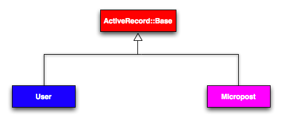

图 2.16：User 模型和 Micropost 模型的继承关系

控制器的继承关系更复杂一些。对比一下代码 2.14 和代码 2.15，我们可以看到 Users 控制器和 Microposts 控制器都继承自应用程序的控制器（`ApplicationController`）。如代码 2.16 所示，`ApplicationController` 继承自 `ActionController::Base`，它是 Rails 中的 Action Pack 库为控制器提供的基类。这些类之间的关系如图 2.17 所示。

**代码 2.14** `UsersController` 类，包含继承关系 <br />`app/controllers/users_controller.rb`

```ruby
class UsersController < ApplicationController
  .
  .
  .
end
```

**代码 2.15** `MicropostsController` 类，包含继承关系 <br />`app/controllers/microposts_controller.rb`

```ruby
class MicropostsController < ApplicationController
  .
  .
  .
end
```

**代码 2.16** `ApplicationController` 类，包含继承关系 <br />`app/controllers/application_controller.rb`

```ruby
class ApplicationController < ActionController::Base
  .
  .
  .
end
```

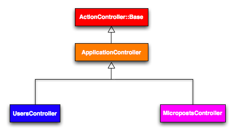

图 2.17：Users 控制器和 Microposts 控制器的继承关系

和模型的继承类似，通过继承 `ActionController::Base`，Users 控制器和 Microposts 控制器获得了很多的功能，例如处理模型对象的功能，过滤输入的 HTTP 请求，以及将视图渲染成 HTML 的功能。因为 Rails 中的控制器都继承自 `ApplicationController`，所以在应用程序控制器中定义的内容就会应用到程序中的所有动作。例如，在 [8.2.1 节](chapter8.html#sec-8-2-1)中将看到如何在应用程序控制器中添加一个登录、退出的帮助方法。

<h3 id="sec-2-3-5">2.3.5 部署演示程序</h3>

完成 Microposts 资源之后，是时候将代码推送到 GitHub 的仓库中了：

```sh
$ git add .
$ git commit -m "Finish demo app"
$ git push
```

通常情况下，你应该经常做一些很小的提交，不过对于本章来说最后做一次大的提交也可以。

然后，你也可以按照 [1.4 节](chapter1.html#sec-1-4)中介绍的方法将演示程序部署到 Heroku：

```sh
$ heroku create --stack cedar
$ git push heroku master
```

最后，迁移生产环境中的数据库（如果得到错误提示请参考下面的内容）

```sh
$ heroku run rake db:migrate
```

上面的代码会用 User 和 Micropost 数据模型更新 Heroku 上的数据库。如果得到与 `vendor/plugins` 中资源（asset）相关的错误提示，暂且忽略它，因为我们还没使用插件。

<h2 id="sec-2-4">2.4 小结</h2>

现在我们已经结束了对一个 Rails 应用程序的分析，本章中开发的演示程序有一些好的地方也有一些有缺陷的地方。

<h4>好的地方</h4>

- 概览了 Rails
- 介绍了 MVC
- 第一次体验了 REST 架构
- 开始使用数据模型了
- 在生产环境中运行了一个基于数据库的 Web 程序

<h4>有缺陷的地方</h4>

- 没有自定义布局和样式
- 没有静态页面（例如“首页”和“关于”）
- 没有用户密码
- 没有用户头像
- 没登录功能
- 不安全
- 没实现用户和微博的自动关联
- 没实现“关注”和“被关注”功能
- 没实现动态列表
- 没使用 TDD
- 没有真的理解所做的事情

本书后续的内容会建立在这些好的部分之上，然后改善有缺陷的部分。

<div class="navigation">
	<a class="prev_page" href="{{ site.url }}/chapter1.html">&laquo; 第一章 从零到部署</a>
	<a class="next_page" href="{{ site.url }}/chapter3.html">第三章 基本静态的页面 &raquo;</a>
</div>

1. 如果要实现内容更长的文章，例如一篇常规博客中的文章，应该将字符串类型（`string`）换成文本类型（`text`）；
1. 脚手架后面跟着的名字和模型一样，是单数形式，而资源和控制器是复数形式。因此是 `User` 而不是 `Users`；
1. 有些文章会说是视图直接将 HTML 返回给浏览器的（通过 Web 服务器，例如 Apache 和 Nginx）。不管实现的细节是怎样的，我更相信控制器是一个中枢，应用程序中所有的信息都会通过它；
1. 加利福尼亚大学欧文分校 2000 年 Roy Thomas Fielding 的博士论文《[架构风格与基于网络的软件架构设计](http://www.ics.uci.edu/~fielding/pubs/dissertation/top.htm)》（译者注：[中文翻译](http://www.redsaga.com/opendoc/REST_cn.pdf)）
1. 和生成 Users 资源的脚手架命令一样，生成 Microposts 资源的脚手架也使用了单数形式，因此我们使用 `generate Micropost`；
1. 和代码 2.7 相比，脚手架生成的代码可能会有额外的空行。你无须担心，因为 Ruby 会忽略额外的空行；
1. 你的控制台可能会显示类似 `ruby-1.9.3-head >` 的开头，示例中使用 `>>` 替代，因为不同的 Ruby 版本会有所不同。
